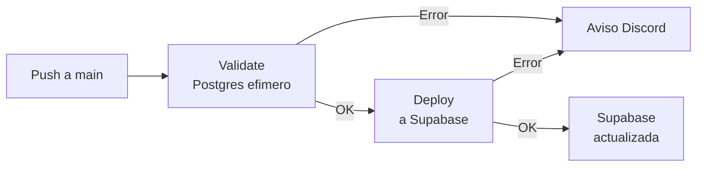

# TBD - Trabajo Final Integrador

Base de datos PostgreSQL para el TFI de Tecnologias de Bases de Datos. Todo el esquema vive en este repo y se aplica automaticamente a una instancia de Supabase compartida por el equipo.

> [!tip]
> **Si nunca colaboraste en un repo de GitHub, leete primero "Como trabajamos" hasta el final.** Esta pensada para arrancar sin instalar nada.

---

## Como trabajamos (sin instalar nada)

Trabajamos 100% desde **github.dev**, un VS Code que corre dentro del navegador. No hace falta Git, Docker, ni un editor instalado: alcanza con tener una cuenta de GitHub.

### El flujo de un cambio, paso a paso

1. **Abri el repo en GitHub.** [github.com/giulianoh92/tfi-tbd-2026](https://github.com/giulianoh92/tfi-tbd-2026).

2. **Apreta la tecla `.` (el punto).** Se abre VS Code dentro del navegador, con todo el codigo del repo cargado. No descarga nada — corre en la nube.

3. **Edita el archivo `.sql` que necesites.** El esquema vive en la carpeta `schema/`. Mas abajo se explica que va en cada subcarpeta.

4. **Commit + push.** En el panel **Source Control** (icono de rama, tercero a la izquierda):
    1. Escribi un mensaje breve (ej: `agregar columna telefono a cliente`).
    2. Click en el `✓` para confirmar el commit.
    3. Click en **Sync Changes** para subirlo a `main`.

5. **GitHub se encarga del resto.** En 30 a 60 segundos tu cambio se aplica a Supabase. Si algo sale mal, llega un aviso al canal de Discord del equipo.

6. **Listo.** Abris Supabase y la base ya tiene tu cambio.

> [!tip]
> Para cambios muy chicos podes editar directo desde la web de github.com: abris el archivo, click al lapiz, editas, commit. Mas limitado que github.dev pero alcanza si tocas una sola linea.

---

## El repo y Supabase: dos cosas distintas

> [!important]
> **Esto es lo mas importante de entender para no confundirse o perder trabajo.**

|   | Repo (GitHub) | Supabase |
|---|---|---|
| **Que es** | El **esquema definitivo** del TFI | La **base de datos en ejecucion** |
| **Quien lo modifica** | Vos, editando archivos `.sql` desde github.dev | Se regenera **automaticamente** cuando pusheas al repo |
| **Permanencia** | **Permanente.** Es la fuente de verdad. | **Efimera.** Se borra y recrea en cada deploy. |
| **Para que sirve** | Definir como debe ser la base | Probar queries, ver datos, validar resultados |

### La regla de oro

> [!warning]
> **Cualquier cambio que hagas DIRECTAMENTE en Supabase (crear una tabla desde el SQL Editor, modificar datos, etc.) SE VA A PERDER al proximo push al repo.**
>
> Si queres que algo sea definitivo, **va al repo**. Supabase es solo el lugar donde se ejecuta lo que escribiste en el repo.

### Para que se usa cada uno

**El repo (GitHub) es para:**
- Definir el esquema final: tablas, FKs, indices, triggers, vistas.
- Cargar los datos de prueba (seeds).
- Versionar todos los cambios: que cambio, cuando, quien.

**Supabase es para:**
- Ver el resultado de aplicar el esquema.
- Probar queries SQL rapidas (ej: `SELECT * FROM alquiler WHERE estado = 'en_curso'`).
- Experimentar con un `CREATE TABLE` o un `INSERT` antes de formalizarlo.
- Confirmar que un cambio que hiciste hace lo que esperabas.

### Ejemplo: como crear una vista nueva, bien

1. Vas al **SQL Editor de Supabase** y escribis la query que necesitas. Iteras hasta que devuelve lo que querias.
2. Abris el repo en github.dev (apretas `.`).
3. Creas el archivo `schema/04_functions/02_vw_lo_que_sea.sql` con `CREATE OR REPLACE VIEW vw_lo_que_sea AS ...`.
4. Commit + push a `main`.
5. Despues del deploy, la vista existe oficialmente y se va a recrear cada vez que el equipo aplica el esquema.

Si te saltearas los pasos 2 a 4 y solo crearas la vista desde el SQL Editor, **se borra al proximo push**. La regla aplica a todo: tablas, datos, funciones, lo que sea.

---

## Como funciona por detras (CI/CD)

Cada push a `main` con cambios en `schema/` dispara el workflow `Deploy Schema to Supabase` en GitHub Actions. Tiene **dos etapas encadenadas**:



### 1. Validate (red de seguridad)

GitHub levanta un **Postgres temporal** dentro de su runner y aplica TODO el esquema desde cero, seeds incluidos. Si algun `.sql` esta roto:
- Sintaxis invalida (`VARCAHR` en vez de `VARCHAR`).
- Una FK que apunta a una columna que no existe.
- Un `UNIQUE` violado por los seeds.

...el job falla aca, en menos de un minuto. **Supabase no se toca.**

### 2. Deploy (aplicar a Supabase)

Solo corre si `validate` paso. Repite el mismo proceso pero contra Supabase:

1. `DROP SCHEMA public CASCADE; CREATE SCHEMA public;`
2. Aplica los archivos en orden: extensiones → tablas → constraints → indices → funciones → seeds → permisos.

Cuando termina, Supabase queda con exactamente lo que define el repo. **Sin diferencias, sin estados a medias.**

### 3. Monitoreo

- **En vivo:** la pestana [Actions](https://github.com/giulianoh92/tfi-tbd-2026/actions) del repo muestra el estado de cada corrida.
- **Notificaciones:** si cualquier paso falla, llega un mensaje al canal de Discord con:
    - Commit (SHA corto + autor + mensaje).
    - Job que fallo (`validate` o `deploy`).
    - Cola del log con el error real.
    - Link directo a la corrida en GitHub.

Si rompiste algo, te enteras enseguida y sabes exactamente que.

---

## Estructura del schema

```
schema/
├── 00_extensions.sql     # Extensiones de PostgreSQL (pgcrypto, btree_gist, pg_cron)
├── 01_tables/            # CREATE TABLE (un archivo por tabla)
├── 02_constraints/       # Foreign keys y constraints multi-columna (FK + EXCLUDE)
├── 03_indexes/           # Indices
├── 04_functions/         # Funciones, procedures, vistas
├── 05_seeds/             # Datos de prueba (INSERT INTO)
├── 06_permissions/       # Roles, RLS policies, GRANT, REVOKE
└── 07_triggers/          # Triggers de auditoria y append-only del log
```

Las carpetas se aplican en orden numerico (`00_` → `07_`). Los archivos dentro de cada carpeta tambien arrancan con dos digitos (`01_`, `02_`, ...) y se aplican en ese orden alfabetico.

La garantia de no-superposicion temporal entre alquileres / reservas la
da una EXCLUDE constraint con `btree_gist` (ver
`schema/02_constraints/14_exclude_alquiler_reserva.sql`), NO un trigger.
El trigger `fn_check_vehiculo_overlap` se conserva como camino feliz
(mensajes legibles antes de que dispare el indice GiST).

**Convencion de comentarios in-line**: cada decision Postgres-especifica
(EXCLUDE, SECURITY DEFINER, RLS `(SELECT helper())`, `session_user` vs
`current_user`, denormalizaciones intencionales) lleva un comentario en
el archivo SQL que explica el porque. Objetivo: que cualquier linea sea
defendible verbalmente en la presentacion academica sin abrir Stack
Overflow ni la documentacion oficial.

> Reglas detalladas (que va en cada carpeta, como nombrar archivos, convenciones de SQL): [`CONTRIBUTING.md`](./CONTRIBUTING.md).

---

## Stack

| Herramienta | Uso |
|---|---|
| **PostgreSQL 16** | Motor de base de datos |
| **Supabase** | PostgreSQL en la nube (entorno compartido) |
| **GitHub Actions** | CI/CD: validacion + deploy automatico |
| **Discord** | Notificaciones de fallos |
| **github.dev** | Editor en el navegador (lo que usamos a diario) |
| Docker *(opcional)* | Postgres local para quien quiera entorno offline |
| pgweb *(opcional)* | Cliente SQL web para el Postgres local |

---

## Desarrollo local (opcional)

> [!note]
> **Esta seccion es opcional.** El flujo principal es desde github.dev: editas, pusheas, el CI valida y aplica. La unica razon para tener entorno local es si queres iterar contra una base de Postgres antes de cada push, **algo que el CI ya hace por vos**. Si nunca tuviste necesidad, no lo instales.

### Requisitos

- **Docker** y **Docker Compose** v2+ -- [Descargar](https://www.docker.com/products/docker-desktop/)
- **Git** -- [Descargar](https://git-scm.com/downloads)
- *(Opcional)* **psql**, **GitHub Desktop**

### Setup

```bash
git clone https://github.com/giulianoh92/tfi-tbd-2026.git
cd tfi-tbd-2026
./scripts/setup.sh
```

Cuando termina, abri **http://localhost:8081** en el navegador para usar pgweb. `setup.sh` crea el `.env`, levanta Docker y aplica el esquema completo.

### Windows (WSL2 + Docker Desktop)

Si estas en Windows, todo se corre desde una terminal **WSL2 (Ubuntu)**. **No uses PowerShell ni CMD** para ejecutar los scripts.

#### 1. Instalar WSL2

Abri **PowerShell como administrador** (click derecho > "Ejecutar como administrador") y ejecuta:

```powershell
wsl --install
```

Esto instala WSL2 con Ubuntu por defecto. **Reinicia la PC** cuando te lo pida. Al reiniciar, se abre una ventana de Ubuntu que te pide crear un usuario y contrasena (son para Linux, no para Windows).

> Si ya tenes WSL pero no es version 2, ejecuta `wsl --set-default-version 2` para actualizar.

#### 2. Instalar Docker Desktop

Descarga e instala [Docker Desktop](https://www.docker.com/products/docker-desktop/). Despues:

1. Abri Docker Desktop.
2. **Settings > Resources > WSL Integration**.
3. Activa la integracion con tu distro Ubuntu.
4. **Apply & Restart**.

#### 3. Instalar Git dentro de WSL

Desde la terminal de Ubuntu:

```bash
sudo apt update && sudo apt install -y git
```

#### 4. Setup normal

Desde la misma terminal de Ubuntu, segui las instrucciones de Setup de arriba.

> Los scripts `.sh`, `docker compose` y `localhost` funcionan igual desde WSL2. El `.gitattributes` del repo asegura line endings Unix (LF) aunque Git este en Windows.

### Comandos utiles

| Comando | Que hace |
|---|---|
| `docker compose up -d` | Levanta base de datos y pgweb |
| `docker compose down` | Para containers (los datos persisten) |
| `docker compose down -v` | Para containers Y borra los datos |
| `docker compose ps` | Estado de los containers |
| `docker compose logs db` | Logs de PostgreSQL |
| `./scripts/setup.sh` | Setup completo (primera vez) |
| `./scripts/deploy.sh` | Drop + recreate del schema local |
| `psql -h localhost -p 5432 -U postgres -d tbd_tfi` | Conectarse por terminal |

### Troubleshooting

**Puerto ocupado.** Cambia `POSTGRES_PORT` o `PGWEB_PORT` en `.env` y volve a `docker compose up -d`.

**pgweb no carga.** Espera unos segundos (arranca despues de PostgreSQL). Verifica con `docker compose ps` y `docker compose logs pgweb`.

**Permission denied en scripts.** `chmod +x scripts/*.sh`.

**Windows: scripts no corren.** Asegurate de estar en una terminal **WSL2 (Ubuntu)**, no PowerShell ni CMD. Si clonaste desde Windows, los line endings pueden estar mal — borra y volve a clonar desde WSL2.

**Falla por orden de dependencias.** Revisa los prefijos numericos de los `.sql`. Las FKs van en `02_constraints/`, no dentro del `CREATE TABLE`.

**Setup manual (si `setup.sh` falla):**

```bash
cp .env.example .env
docker compose up -d
./scripts/deploy.sh
```

---

## Política transaccional

Todos los procedimientos de negocio (`pa_registrar_reserva`, `pa_cancelar_reserva`, `pa_registrar_alquiler`, `pa_finalizar_alquiler`, `pa_enviar_mantenimiento_programado`, `pa_registrar_devolucion_mantenimiento`, `pa_registrar_cliente_con_usuario`, `pa_crud_vehiculo`, etc.) envuelven su cuerpo en un bloque `BEGIN ... EXCEPTION WHEN unique_violation | foreign_key_violation | check_violation | OTHERS THEN ... END`. Esto es el mecanismo **idiomatico** de PostgreSQL para control transaccional con rollback ante error: cada `BEGIN` asocia un savepoint implicito y, si una excepcion se captura, se hace rollback al savepoint mientras la transaccion del caller sigue viva. Los procedimientos retornan siempre `(p_estado, p_mensaje [, p_id_generado])` para que el frontend muestre mensajes legibles en vez de errores 500.

El `COMMIT` / `ROLLBACK` literal estilo Oracle **solo** se puede ejecutar dentro de un `PROCEDURE` cuando el caller no abrio una transaccion previa. Supabase / PostgREST abre una transaccion HTTP antes de cada `CALL`, asi que un `COMMIT;` explicito en produccion dispara `2D000 invalid_transaction_termination`. Para demostrar competencia con la sintaxis literal del PDF de la catedra hay un script aparte: `tests/transacciones_explicitas.sql` define `pa_demo_transaccional()` con `COMMIT;` y `ROLLBACK;` reales y se ejecuta via `scripts/demo-transaccional.sh` (que invoca `psql -f`, fuera de RPC). El fundamento completo de esta decision esta en [`docs/requisitos/JUSTIFICACION.md`](docs/requisitos/JUSTIFICACION.md) §R2.
