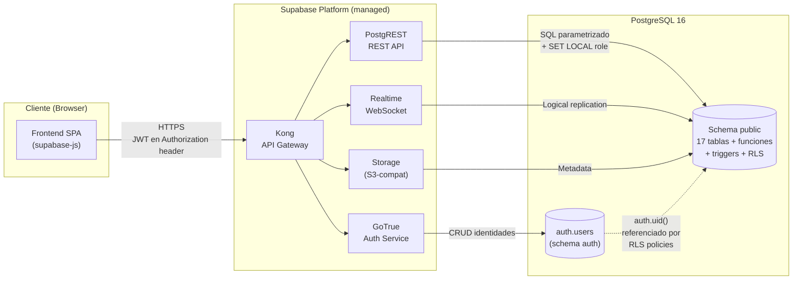
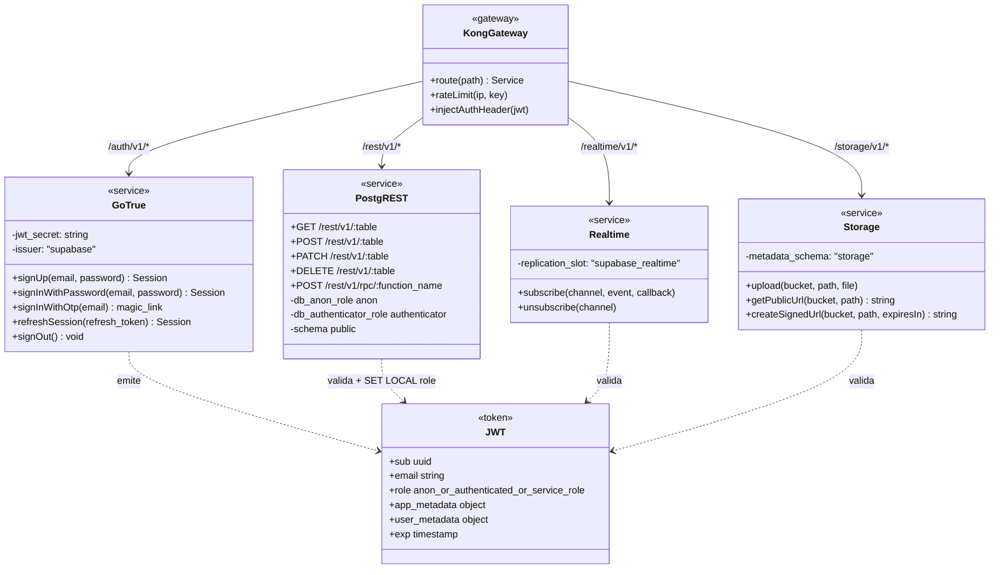
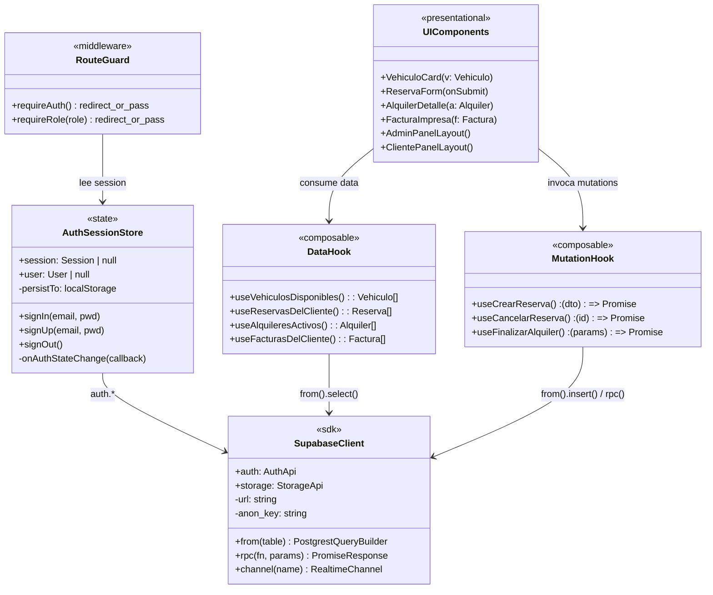
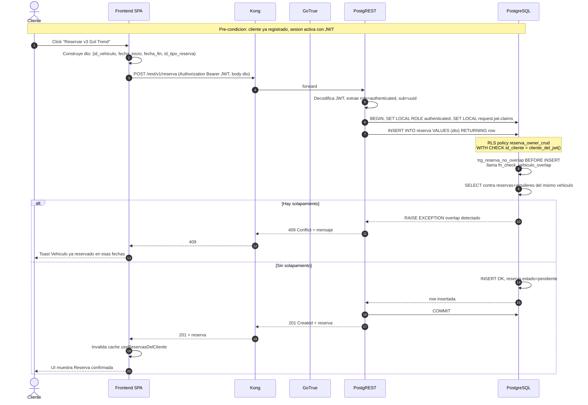
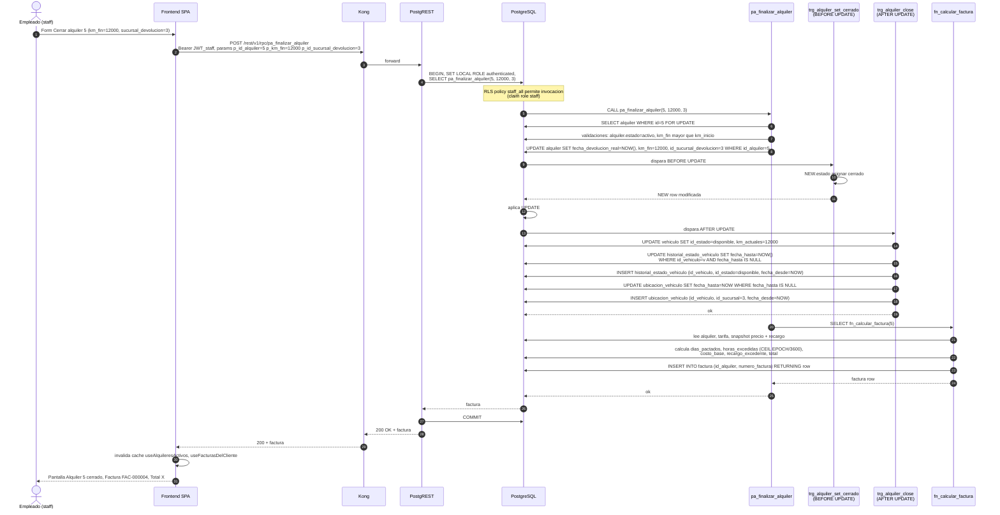
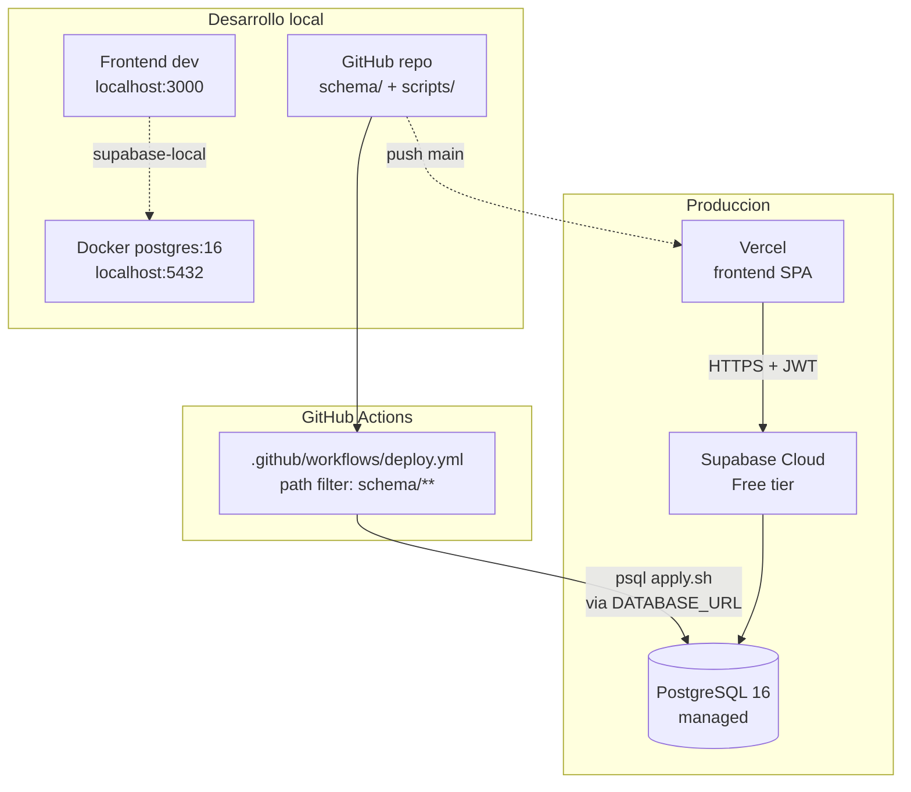

# Arquitectura — Sistema de Alquiler de Vehículos (TBD TFI 2026)

> **Documento de diseño arquitectónico — Etapa 2.**
> Materia: Tecnologías de Bases de Datos · UTN FRRe · Cuatrimestre 1 2026
> Autor del modelado: Giuliano Holzmann · Aportes: Marcia Viera

---

## 1. Resumen ejecutivo

El sistema implementa un **modelo BaaS (Backend-as-a-Service) puro** sobre Supabase. Toda la lógica de negocio, autorización y validación vive en **PostgreSQL** (constraints, triggers, funciones, procedures, Row Level Security). El frontend se comunica directamente con la base de datos a través de la **API REST auto-generada por PostgREST**, autenticando vía **JWT emitidos por GoTrue**.

**Decisión de diseño clave:** No se desarrolla un backend tradicional ni Edge Functions. Todas las operaciones se cubren con:

- **PostgREST** → CRUD genérico sobre tablas/vistas
- **JWT + RLS** → autorización por fila evaluada por Postgres
- **Funciones SQL invocadas vía RPC** → lógica de dominio (ej. `pa_finalizar_alquiler`, `fn_calcular_factura`)
- **Triggers** → invariantes de dominio y cascadas de estado (lifecycle de alquiler, mantenimiento, ubicación)

Esto reduce la superficie del sistema a dos artefactos desplegables: el **schema SQL** (fuente de verdad en este repo) y la **app de frontend** (desplegable estático).

---

## 2. Vista de componentes (alto nivel)



### Componentes

| # | Componente | Responsabilidad | Mantenimiento |
|---|------------|-----------------|---------------|
| 1 | **Frontend SPA** | UI, manejo de sesión local, llamadas a Supabase. Sin lógica de negocio. | Equipo dev |
| 2 | **Kong (API Gateway)** | Single entrypoint, routing por path, rate limiting. | Supabase managed |
| 3 | **GoTrue (Auth)** | Signup/login, emisión de JWT firmados (HS256), refresh tokens, OAuth. | Supabase managed |
| 4 | **PostgREST** | Traduce HTTP → SQL; deriva endpoints leyendo `information_schema`. | Supabase managed |
| 5 | **Realtime** | Stream de cambios vía replication slots → WebSocket. | Supabase managed (opcional) |
| 6 | **Storage** | Buckets para imágenes de vehículos (alternativa a URLs externas actuales). | Supabase managed (opcional) |
| 7 | **PostgreSQL 16** | Motor relacional. Lógica de dominio completa. | Self-managed vía repo |

---

## 3. PostgreSQL — diagrama de clases internas

El núcleo del sistema. Cinco bloques lógicos: **tablas de dominio**, **catálogos**, **funciones de negocio**, **triggers de invariantes**, **policies RLS**.

```mermaid
classDiagram
    direction LR

    class Tablas_Dominio {
        <<schema public>>
        +usuario(id_usuario, username, password_hash, email)
        +cliente(id_cliente, id_usuario FK, dni, nombre, ...)
        +sucursal(id_sucursal, nombre, direccion, ...)
        +vehiculo(id_vehiculo, id_sucursal_origen FK, id_estado FK, ...)
        +reserva(id_reserva, id_cliente FK, id_vehiculo FK, id_tipo_reserva FK, estado)
        +alquiler(id_alquiler, id_reserva FK, id_vehiculo FK, id_sucursal_devolucion FK, estado)
        +mantenimiento(id_mantenimiento, id_vehiculo FK, id_taller FK, ...)
        +factura(id_factura, id_alquiler FK, numero_factura, total, ...)
        +historial_estado_vehiculo(...)
        +ubicacion_vehiculo(...)
    }

    class Catalogos {
        <<schema public>>
        +estado_vehiculo(id_estado, codigo, descripcion)
        +tipo_vehiculo(id_tipo, codigo, descripcion)
        +tipo_reserva(id_tipo_reserva, codigo, requiere_garantia, ...)
        +tarifa(id_tarifa, id_tipo_vehiculo FK, id_sucursal FK, precio_por_dia, porcentaje_recargo)
    }

    class Funciones_Negocio {
        <<plpgsql>>
        +fn_check_vehiculo_overlap() RETURNS trigger
        +fn_alquiler_lifecycle() RETURNS trigger
        +fn_mantenimiento_lifecycle() RETURNS trigger
        +fn_calcular_factura(p_id_alquiler bigint) RETURNS factura
        +pa_finalizar_alquiler(p_id_alquiler, p_km_fin, p_id_sucursal_devolucion) PROCEDURE
    }

    class Triggers_Invariantes {
        <<auto-fire>>
        +trg_reserva_no_overlap BEFORE INSERT/UPDATE ON reserva
        +trg_alquiler_no_overlap BEFORE INSERT/UPDATE ON alquiler
        +trg_alquiler_start AFTER INSERT ON alquiler
        +trg_alquiler_set_cerrado BEFORE UPDATE ON alquiler
        +trg_alquiler_close AFTER UPDATE ON alquiler
        +trg_mantenimiento_envio AFTER INSERT ON mantenimiento
        +trg_mantenimiento_devolucion AFTER UPDATE ON mantenimiento
    }

    class Policies_RLS {
        <<ROW LEVEL SECURITY>>
        +cliente_self_read ON cliente USING auth.uid()
        +reserva_owner_crud ON reserva USING auth.uid()
        +vehiculo_public_read ON vehiculo FOR SELECT
        +staff_all ON * TO authenticated WHERE jwt->>role = 'staff'
    }

    class Roles {
        <<cluster-level>>
        +postgres (owner, apply.sh)
        +authenticator (PostgREST switches roles)
        +anon (no JWT)
        +authenticated (JWT valido)
        +service_role (bypass RLS)
        +quique (evaluacion docente, full grants)
    }

    Tablas_Dominio --> Catalogos : FK
    Triggers_Invariantes --> Funciones_Negocio : invoca
    Triggers_Invariantes ..> Tablas_Dominio : modifica
    Funciones_Negocio ..> Tablas_Dominio : lee/escribe
    Policies_RLS ..> Tablas_Dominio : filtra rows
    Roles ..> Policies_RLS : evaluado por
```



### Convenciones del schema

- **PK**: `BIGSERIAL` en todas las tablas (`id_<entidad>`)
- **Dinero**: `NUMERIC(12,2)`
- **Estados de máquina de estado**: catálogo FK (no `VARCHAR` enum), excepto enums simples (`alquiler.estado`, `reserva.estado`)
- **Snapshots de tarifa**: `factura.precio_por_dia_aplicado` y `porcentaje_recargo_aplicado` se persisten en la factura para que cambios futuros de tarifa no alteren históricos
- **Idempotencia**: `apply.sh` ejecuta `DROP SCHEMA public CASCADE; CREATE SCHEMA public;` y reaplica todo desde el repo. La base es **stateless por diseño** — toda la verdad vive en el repo

---

## 4. Supabase Platform — diagrama de clases internas



### Mecánica PostgREST + RLS

1. Cliente manda `Authorization: Bearer <JWT>`
2. PostgREST decodifica JWT, extrae `role` y `sub`
3. Abre conexión como `authenticator`, ejecuta `SET LOCAL ROLE <role_del_jwt>` y `SET LOCAL request.jwt.claims = '<json>'`
4. Postgres ejecuta query con identidad del usuario; `auth.uid()` retorna el `sub`
5. RLS policies filtran filas según `auth.uid()` o `auth.jwt() ->> 'role'`

**Implicación arquitectónica:** PostgREST no es un ORM ni un mapper — es un *traductor sintáctico*. Toda la autorización es responsabilidad de Postgres vía RLS.

---

## 5. Frontend — diagrama de clases internas (agnóstico de framework)



### Capas del frontend

| Capa | Rol | Equivalente en frameworks comunes |
|------|-----|-----------------------------------|
| **SDK** | Singleton `createClient(URL, ANON_KEY)`. Único punto de contacto con Supabase. | `lib/supabase.ts` |
| **AuthSessionStore** | Estado global de sesión. Listener de `onAuthStateChange`. | Context React / Pinia / Svelte store |
| **DataHook** | Suscripción declarativa a queries. Cache, refetch, loading state. | `useSWR`, `useQuery`, `createResource` |
| **MutationHook** | Disparador imperativo de cambios + invalidación de cache. | `useMutation` |
| **RouteGuard** | Middleware de ruteo según `session` y `role`. | Middleware Next.js, navigation guards |
| **UI** | Componentes puros, sin acceso directo a SDK. | React/Vue/Svelte components |

---

## 6. Casos de uso — diagramas de secuencia

### 6.1. Cliente reserva un vehículo online



### 6.2. Empleado finaliza un alquiler (RPC + cascada de triggers)

Este caso ejercita la pieza central del sistema: una única invocación RPC dispara la procedure `pa_finalizar_alquiler`, que delega en triggers para cerrar el alquiler, abrir/cerrar ubicaciones, mirrorear el estado del vehículo y emitir factura.



**Observación arquitectónica:** El frontend hace **una sola llamada HTTP**. Todo lo que ocurre dentro de la DB (UPDATE → trigger BEFORE → trigger AFTER → INSERTs en 4 tablas → cálculo de factura) sucede en una **única transacción**. Si cualquier paso falla, la transacción revierte y el frontend recibe el error con rollback completo. Esto es el equivalente arquitectónico de un "endpoint transaccional de backend" sin que exista backend.

---

## 7. Recomendación de stack frontend

Criterios: **simple de levantar**, **template oficial con Supabase**, **TypeScript end-to-end**, **deploy gratis**, **CRUD fluido**.

### Recomendación primaria: **Next.js 14 + Supabase Starter**

```bash
npx create-next-app@latest tbd-tfi-frontend -e with-supabase
cd tbd-tfi-frontend
# Editar .env.local con NEXT_PUBLIC_SUPABASE_URL y NEXT_PUBLIC_SUPABASE_ANON_KEY
bun install
bun dev
```

| Aspecto | Por qué |
|---------|---------|
| Template oficial Supabase | Auth flow (signup, login, magic link, reset password) ya cableado |
| App Router | Server components leen Supabase con cookies HttpOnly (más seguro que solo client) |
| TypeScript | `supabase gen types typescript --linked > types/database.ts` regenera types desde el schema |
| Tailwind + shadcn/ui | `npx shadcn-ui@latest add table form button` da componentes copy-paste sin engordar el bundle |
| Deploy | `vercel deploy` gratis, integra con git |
| Ecosistema | TanStack Query / SWR / Zustand encajan bien |

### Alternativas evaluadas

| Stack | Cuándo conviene | Trade-off |
|-------|-----------------|-----------|
| **Refine.dev + Supabase data provider** | Si querés panel admin instantáneo (CRUD scaffolded por schema) y poco custom UX | Menos flexible para UX a medida del cliente final |
| **SvelteKit + Supabase** | Equipo más cómodo con Svelte; bundle más chico | Comunidad y ejemplos más chicos que Next |
| **Nuxt 3 + @nuxtjs/supabase** | Equipo Vue | Mismo nivel de soporte que Next, pero menos templates listos |
| **Astro + supabase-js** | Sitios principalmente estáticos con CRUD esporádico | El alquiler tiene mucha interactividad → menos buen fit |
| **Vite + React + supabase-js** | Máxima simpleza, sin SSR | Tenés que cablear auth, ruteo, types manualmente |

**Conclusión:** Next.js 14 + template `with-supabase` es el mejor punto de entrada. Cubre auth, ruteo, SSR, types generados y deploy en una sola decisión.

---

## 8. Vista de despliegue



### Flujo de entrega

1. Cualquier cambio en `schema/**` que llega a `main` dispara `deploy.yml`
2. CI ejecuta `scripts/apply.sh` contra Supabase Cloud usando `DATABASE_URL` secret → `DROP SCHEMA public CASCADE; CREATE SCHEMA public;` + reaplicación completa
3. En caso de fallo, `scripts/notify-discord.sh` notifica
4. Frontend en Vercel se redeploya en cada push (independiente del schema)

### Entornos

| Entorno | Postgres | Frontend | Auth |
|---------|----------|----------|------|
| Local dev | Docker `postgres:16` + Supabase CLI (`supabase start`) | `bun dev` en localhost:3000 | GoTrue local |
| Producción | Supabase Cloud (free tier) | Vercel | GoTrue managed |

---

## 9. Decisiones arquitectónicas registradas (ADRs cortos)

| # | Decisión | Razón |
|---|----------|-------|
| 1 | BaaS puro, sin backend propio | El alcance del TPI cabe entero en PostgREST + RLS + RPC. Reduce código a mantener. |
| 2 | Sin Edge Functions | No hay integraciones con terceros (pagos, mail) en el alcance. Si más adelante hicieran falta, se agregan sin tocar lo demás. |
| 3 | Autorización 100% en Postgres (RLS) | Una sola fuente de verdad para permisos. El frontend no puede saltarla. |
| 4 | Lógica transaccional en SQL (procedures + triggers) | Atomicidad nativa, sin orquestador externo. Caso `pa_finalizar_alquiler` demuestra el patrón. |
| 5 | Schema idempotente, repo como source-of-truth | `apply.sh` recrea desde cero. Reproducibilidad total entre dev y producción. |
| 6 | Frontend Next.js + template oficial Supabase | Tiempo a primer demo más corto del ecosistema. Types auto-generados. |
| 7 | Imágenes vía URLs públicas (GitHub raw) | Suficiente para demo. Migración a Supabase Storage es trivial cuando haga falta. |

---

## 10. Referencias

- Documento de diseño Etapa 1: `TFI-2026 - Alquiler de Vehículos.pdf`
- Schema SQL: `schema/` (tablas, constraints, indexes, functions, seeds, permissions)
- Procedure central: `schema/04_functions/06_pa_finalizar_alquiler.sql`
- Función de facturación: `schema/04_functions/05_fn_calcular_factura.sql`
- Rol de evaluación docente: `schema/06_permissions/01_profesor_quique.sql`
- Documentación Supabase: https://supabase.com/docs
- PostgREST: https://postgrest.org
