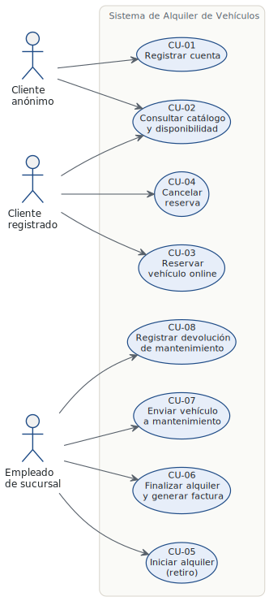

**Trabajo Final Integrador**

# Sistema de Alquiler de Vehículos

**Cátedra:** Tecnologías de Bases de Datos

**Docentes:**

- Ing. Suenaga, Roberto
- Ing. Barreyro, Enrique

**Ciclo Lectivo:** Primer Cuatrimestre del 2026

**Grupo N°3 — Integrantes**

| Apellido y Nombre | Matrícula |
| ----- | :---: |
| Dominguez, Franco Agustín | 67575 |
| Hillebrand, Giuliano | 67625 |
| González, Martín Gastón | 67501 |
| Valchar, Angelo Iván | 67585 |
| Viera, Marcia | 64700 |

## Índice

<ul>
  <li><a href="#disclaimer-ia">Declaración de uso informado de inteligencia artificial generativa</a></li>
  <li><a href="#introduccion">Introducción</a></li>
  <li><a href="#modalidad">Modalidad de trabajo</a></li>
  <li><a href="#rol-docente">Rol del docente</a></li>
  <li><a href="#comunicacion">Comunicación equipo de IT y cliente</a></li>
  <li><a href="#descripcion-escenario">Descripción del escenario</a></li>
  <li><a href="#etapas-trabajo">Etapas del trabajo</a></li>
  <li>
    <a href="#etapa-1">Etapa 1: modelado de la base de datos</a>
    <ul>
      <li><a href="#analisis-requisitos">Análisis de requisitos</a></li>
      <li><a href="#der">Diagrama entidad-relación</a></li>
      <li><a href="#consideraciones-diseno">Consideraciones de diseño del modelo de datos</a></li>
    </ul>
  </li>
  <li>
    <a href="#casos-uso">Casos de uso</a>
    <ul>
      <li><a href="#actores">Actores</a></li>
      <li><a href="#catalogo-cu">Catálogo de casos de uso</a></li>
      <li><a href="#diagrama-cu">Diagrama de casos de uso</a></li>
      <li><a href="#mapeo-cu">Mapeo caso de uso ↔ modelo de datos</a></li>
      <li>
        <a href="#detalle-cu">Detalle de casos de uso principales</a>
        <ul>
          <li><a href="#cu-03">CU-03: Reservar vehículo online</a></li>
          <li><a href="#cu-05">CU-05: Iniciar alquiler (retiro del vehículo)</a></li>
          <li><a href="#cu-06">CU-06: Finalizar alquiler y generar factura</a></li>
          <li><a href="#cu-07">CU-07: Enviar vehículo a mantenimiento</a></li>
        </ul>
      </li>
    </ul>
  </li>
  <li>
    <a href="#etapa-2">Etapa 2: implementación en el SGBD</a>
    <ul>
      <li><a href="#requerimientos-etapa-2">Requerimientos técnicos de la Etapa 2</a></li>
      <li><a href="#stack-tecnologico">Stack tecnológico</a></li>
      <li><a href="#arquitectura-schema">Arquitectura del schema</a></li>
      <li><a href="#catalogo-ddl">Catálogo de objetos DDL</a></li>
      <li><a href="#impl-cu">Implementación de los casos de uso</a></li>
      <li><a href="#auditoria-r1">Auditoría — triple identidad</a></li>
      <li><a href="#excepciones">Excepciones y transacciones</a></li>
      <li><a href="#mapeo-r">Mapeo de requerimientos</a></li>
      <li><a href="#der-etapa2">Diagrama ER actualizado</a></li>
      <li><a href="#conclusiones-etapa-2">Conclusiones</a></li>
    </ul>
  </li>
  <li><a href="#referencias">Referencias</a></li>
</ul>

## Declaración de uso informado de inteligencia artificial generativa

Los integrantes del Grupo 3 declaran haber utilizado herramientas de inteligencia artificial generativa durante la elaboración de este documento, en el marco de un uso informado y responsable. Su empleo se circunscribió a las siguientes actividades de soporte:

- **Formato y diseño visual**: estructuración del documento (encabezados, tablas, separación de secciones), generación de los diagramas (entidad-relación en Mermaid, casos de uso en PlantUML) a partir del diccionario de datos definido por los autores, y aplicación de criterios tipográficos consistentes.
- **Asistencia de redacción**: sugerencias de fraseo, mejora de la claridad expositiva y revisión ortográfica y gramatical sobre textos previamente concebidos por los autores.
- **Revisión de contenido**: detección de inconsistencias internas entre el diccionario de datos, las relaciones, el diagrama y los casos de uso; verificación de la trazabilidad entre requisitos del enunciado y entidades del modelo.

El **análisis del problema, las decisiones de diseño y la justificación de cada elección** —incluyendo la elección de las entidades, la normalización aplicada, la introducción de catálogos (`estado_vehiculo`, `tipo_reserva`), la separación entre pertenencia y ubicación física del vehículo y el patrón de snapshot en `factura`— son obra y responsabilidad íntegra de los autores. La inteligencia artificial actuó exclusivamente como herramienta de soporte; en ningún caso reemplazó el juicio técnico ni la autoría intelectual del grupo.

Durante la implementación de la Etapa 2, se mantuvo el mismo marco de uso responsable. La inteligencia artificial asistió en la redacción técnica, el formateo de tablas comparativas y la revisión de consistencia entre los procedimientos almacenados y los requerimientos de la cátedra. El diseño de cada función, vista y disparador, así como la justificación arquitectónica de elegir PostgreSQL + Supabase como stack y de exponer la lógica de negocio mediante `FUNCTION`s en lugar de `PROCEDURE`s, son obra y responsabilidad íntegra del grupo de autores.

## Introducción

Este documento reúne la información de la consigna del Trabajo Final Integrador y funciona como documentación del proceso de diseño e implementación de la base de datos que busca resolver una problemática real. Además, este documento es de elaboración propia de los integrantes del Grupo 3.

En el marco de la materia, se desarrollará un Trabajo Final Integrador (TFI) cuyo objetivo es aplicar de manera práctica los conceptos vistos durante el cursado, abordando inicialmente el diseño y posterior implementación de una base de datos.

El trabajo se organizará en distintas etapas, permitiendo una evolución progresiva del sistema, incorporando nuevos requisitos y complejidades a lo largo del desarrollo.

## Modalidad de trabajo

El Trabajo Integrador deberá realizarse en grupos de cinco (5) alumnos.

Se espera que todos los integrantes participen activamente en el análisis, diseño y desarrollo de la solución propuesta.

## Rol del docente

El docente actúa como cliente a satisfacer.

Por lo tanto:

* Toda consulta sobre el entendimiento de la lógica del sistema deberá ser realizada al docente.
* La propuesta de diseño deberá ser aprobada por el cliente antes de su implementación en la base de datos.

## Comunicación equipo de IT y cliente

Por medio del servidor de Discord ya establecido para la materia.

## Descripción del escenario

Una empresa de alquiler de vehículos posee varias sucursales, en las cuales se dispone de autos para alquilar.

Los clientes pueden reservar para posteriormente alquilar vehículos por un período determinado, indicando la fecha de inicio y la fecha de devolución prevista.

### Requisitos del sistema

* Al momento de iniciar el alquiler, se debe registrar la cantidad de kilómetros del vehículo, y al momento de finalizarlo, se debe registrar nuevamente esta información.

* Cada vehículo pertenece a una sucursal y tiene un tipo (por ejemplo: cupé, sedán, SUV, etc.), además de información descriptiva como marca, modelo y un detalle de confort.

* Por cada vehículo se podrán registrar entre 1 y 5 imágenes que permitan al cliente visualizar sus características.

* Los vehículos pueden estar en distintos estados, tales como: disponible, alquilado o en mantenimiento.

* Cada alquiler corresponde a un único cliente y a un único vehículo.

* El valor del alquiler es por día, y depende tanto del tipo de vehículo como de la sucursal donde se realiza el alquiler.

* Asimismo, en caso de que el vehículo sea devuelto fuera del tiempo pactado, se deberá cobrar un recargo por hora excedida, calculado como un porcentaje del valor diario del alquiler. Dicho porcentaje también depende del tipo de vehículo y de la sucursal.

* El sistema deberá generar una factura al finalizar el alquiler a nombre del cliente, donde se detalle el costo del alquiler y los recargos aplicados.

* Los clientes podrán realizar reservas de vehículos de forma online, para lo cual deberán registrarse en el sistema mediante un usuario y contraseña.

* La reserva de un vehículo deberá validar la disponibilidad del mismo en las fechas solicitadas, evitando superposición con otros alquileres o reservas existentes.

* El estado "en mantenimiento" del vehículo surge del envío del mismo a un taller mecánico, dicho envío debe ser registrado, y deberá incluirse la información de fecha envío y fecha de devolución.

## Etapas del trabajo

1. Modelado de la Base de datos que solucione el problema (30/04/2026)
2. Implementación en el SGBD elegido, más lógica de negocio parcial aplicada en procedimientos / funciones / disparadores, etc. (21/05/2026)
3. Presentación de la solución final, lógica de negocio terminada en el SGBD más desarrollado en framework a elección, de las interfaces necesarias para el funcionamiento del sistema. (11/06/2026)

Importante: La implementación en framework no abarcará la totalidad del sistema. Los módulos a desarrollar serán definidos durante el cursado.

## Etapa 1: modelado de la base de datos

### Análisis de requisitos

Del enunciado se extraen los siguientes requisitos principales:

#### Entidades y atributos

| Entidad | Atributos | Observaciones |
| ----- | ----- | ----- |
| alquiler | id_alquiler, id_reserva, id_cliente, id_vehiculo, id_tarifa, id_sucursal_devolucion, fecha_inicio, fecha_fin_prevista, fecha_devolucion_real, km_inicio, km_fin, estado. | Registra cada alquiler efectivo de un vehículo por parte de un cliente, incluyendo los kilómetros al inicio y al cierre, las fechas pactadas y la devolución real. La FK `id_sucursal_devolucion` permite registrar devoluciones cruzadas en una sucursal distinta a la de origen del vehículo. |
| cliente | id_cliente, id_usuario, nombre, apellido, dni, telefono, direccion. | Representa a la persona física que realiza alquileres y reservas. Puede estar vinculado a un usuario del sistema para operar de forma online. |
| estado_vehiculo | id_estado, nombre, descripcion. | Catálogo de estados posibles del vehículo ('disponible', 'alquilado', 'en_mantenimiento', 'en_traslado', etc.). Reemplaza al enum embebido para permitir agregar estados nuevos sin alterar la estructura de la tabla `vehiculo`. |
| factura | id_factura, id_alquiler, id_cliente, numero_factura, fecha_emision, precio_por_dia_aplicado, porcentaje_recargo_aplicado, costo_base, horas_excedidas, recargo_excedente, total. | Comprobante generado al finalizar un alquiler, detallando el costo base por días y los recargos por horas excedidas si correspondiera. Se conserva `id_cliente` como snapshot histórico del cliente facturado. Se almacenan además `precio_por_dia_aplicado` y `porcentaje_recargo_aplicado` como snapshot de la tarifa vigente al momento de emisión, garantizando que la factura sea autocontenida para auditoría fiscal independientemente de cambios futuros en la tabla `tarifa`. |
| garantia_reserva | id_garantia, id_reserva, tipo, titular, numero_tarjeta_hash, vencimiento, fecha_registro, activa. | Almacena la información de la tarjeta de crédito (u otro medio de garantía) que respalda una reserva. El campo `activa` (boolean) permite invalidar la garantía sin eliminarla cuando la reserva se cancela, preservando la trazabilidad. Tabla separada por aislamiento de datos sensibles y flexibilidad para incorporar otros tipos de garantía a futuro. |
| historial_estado_vehiculo | id_historial, id_vehiculo, id_estado, fecha_inicio, fecha_fin, motivo. | Registra cada transición de estado de un vehículo a lo largo del tiempo, permitiendo auditar cuándo y por qué cambió. El registro vigente tiene `fecha_fin` en NULL. |
| imagen_vehiculo | id_imagen, id_vehiculo, url_imagen, orden. | Almacena entre 1 y 5 imágenes asociadas a cada vehículo, permitiendo al cliente visualizar sus características antes de reservar. |
| mantenimiento | id_mantenimiento, id_vehiculo, id_taller, fecha_envio, fecha_devolucion, observaciones. | Registra el historial de envíos de un vehículo a un taller mecánico, incluyendo las fechas de entrada y salida y las observaciones del servicio realizado. |
| reserva | id_reserva, id_cliente, id_vehiculo, id_tipo_reserva, fecha_inicio, fecha_fin_prevista, estado, fecha_creacion. | Representa la reserva online de un vehículo por parte de un cliente para un período determinado, validando que no exista superposición con otros alquileres o reservas activas. La FK `id_tipo_reserva` define qué reglas de negocio (por ejemplo, obligatoriedad de garantía) aplican a la reserva. |
| sucursal | id_sucursal, nombre, direccion, ciudad, telefono. | Cada sede física de la empresa donde se encuentran los vehículos disponibles para alquilar y donde se gestionan los alquileres presenciales. |
| taller | id_taller, nombre, direccion, telefono. | Taller mecánico externo al que se envían los vehículos cuando requieren mantenimiento, dejando el vehículo fuera de disponibilidad durante ese período. |
| tarifa | id_tarifa, id_sucursal, id_tipo, precio_por_dia, porcentaje_recargo. | Define el precio diario del alquiler y el porcentaje de recargo por hora excedida según la combinación de tipo de vehículo y sucursal. `porcentaje_recargo` se almacena como decimal en formato fracción (por ejemplo, 0.20 representa 20%). Cada combinación (id_sucursal, id_tipo) es única. |
| tipo_reserva | id_tipo_reserva, nombre, descripcion, requiere_garantia, antelacion_max_dias. | Catálogo de tipos de reserva permitidos (estándar, express, corporativa, etc.). Permite condicionar reglas de negocio diferenciales como obligatoriedad de garantía y plazos máximos de antelación, sin codificarlas en la lógica de aplicación. |
| tipo_vehiculo | id_tipo, nombre, descripcion. | Categoría que clasifica a los vehículos según su carrocería (Sedán, SUV, Cupé, etc.), siendo un factor determinante en el cálculo de la tarifa. |
| ubicacion_vehiculo | id_ubicacion, id_vehiculo, id_sucursal, fecha_desde, fecha_hasta. | Registra en qué sucursal se encuentra físicamente cada vehículo en cada momento. Disocia la **pertenencia** (sucursal de origen, atributo de `vehiculo`) de la **ubicación operativa** (esta tabla). El registro vigente tiene `fecha_hasta` en NULL. |
| usuario | id_usuario, username, password_hash, email, created_at. | Credenciales de acceso al sistema online para que los clientes puedan realizar reservas de forma remota mediante usuario y contraseña. |
| vehiculo | id_vehiculo, id_sucursal_origen, id_tipo, id_estado, marca, modelo, anio, patente, km_actuales, detalle_confort. | Unidad disponible para alquilar, perteneciente (origen) a una sucursal y clasificada por tipo. Su estado actual se referencia mediante `id_estado` (FK al catálogo `estado_vehiculo`) y su ubicación física se gestiona en la tabla `ubicacion_vehiculo`. |

#### Relaciones

| Relación | Cardinalidad | Descripción |
| ----- | :---: | ----- |
| alquiler a factura | 1:1 | Factura generada por cada alquiler finalizado |
| cliente a alquiler | 1:N | Un cliente puede realizar múltiples alquileres |
| cliente a reserva | 1:N | Un cliente puede realizar múltiples reservas |
| cliente a usuario | 1:0..1 | Un cliente puede tener un usuario para login (no obligatorio: los clientes presenciales no requieren cuenta online) |
| estado_vehiculo a vehiculo | 1:N | Cada vehículo referencia un estado del catálogo |
| estado_vehiculo a historial_estado_vehiculo | 1:N | Cada estado puede aparecer en múltiples transiciones registradas |
| reserva a alquiler | 0..1:0..1 | Una reserva puede concretarse en un alquiler (no obligatorio); un alquiler puede provenir de una reserva o ser presencial sin reserva previa |
| reserva a garantia_reserva | 1:0..1 | Una reserva tiene a lo sumo una garantía asociada (obligatoria solo si el tipo de reserva la exige) |
| sucursal a alquiler (devolución) | 1:N | Sucursal donde se devuelve el vehículo (puede diferir de la de origen) |
| sucursal a tarifa | 1:N | Una sucursal define múltiples tarifas según el tipo de vehículo |
| sucursal a ubicacion_vehiculo | 1:N | Una sucursal aloja múltiples vehículos a lo largo del tiempo |
| sucursal a vehiculo (origen) | 1:N | Cada vehículo pertenece (origen) a una sucursal |
| taller a mantenimiento | 1:N | Un taller recibe múltiples envíos de mantenimiento |
| tarifa (tipo_vehiculo y sucursal) a alquiler | 1:N | Precios definidos según tipo de vehículo y sucursal |
| tipo_reserva a reserva | 1:N | Cada reserva pertenece a un tipo definido en el catálogo |
| tipo_vehiculo a tarifa | 1:N | Cada tipo de vehículo participa en múltiples tarifas según la sucursal |
| tipo_vehiculo a vehiculo | 1:N | Clasificación de vehículos por tipo |
| vehiculo a alquiler | 1:N | Un vehículo puede tener múltiples alquileres |
| vehiculo a historial_estado_vehiculo | 1:N | Histórico de transiciones de estado de un vehículo |
| vehiculo a imagen_vehiculo | 1:1..5 | Entre 1 y 5 imágenes obligatorias por vehículo (cota inferior reforzada por aplicación o trigger; cota superior por trigger sobre `imagen_vehiculo`) |
| vehiculo a mantenimiento | 1:N | Histórico de mantenimientos de un vehículo |
| vehiculo a reserva | 1:N | Un vehículo puede tener múltiples reservas |
| vehiculo a ubicacion_vehiculo | 1:N | Histórico de ubicaciones físicas de un vehículo |

#### Restricciones adicionales de unicidad

A continuación se listan las restricciones `UNIQUE` que el modelo asume y que se aplicarán al implementar el esquema en el SGBD (Etapa 2). Estas no se reflejan en la notación Mermaid utilizada para el DER porque el dialecto no incluye un símbolo nativo para unicidad fuera de las claves primarias.

| Tabla | Columna(s) `UNIQUE` | Justificación |
| ----- | ----- | ----- |
| `usuario` | `username` | Identificador único de login. |
| `usuario` | `email` | Recuperación de cuenta y canal de contacto. |
| `cliente` | `dni` | Identificador legal único del titular. |
| `cliente` | `id_usuario` | Refuerza la cardinalidad 1:0..1 con `usuario`. |
| `vehiculo` | `patente` | La patente identifica unívocamente al vehículo en la realidad. |
| `tarifa` | `(id_sucursal, id_tipo)` | Una sola tarifa por combinación de sucursal y tipo de vehículo. |
| `factura` | `numero_factura` | Numeración correlativa única exigida por auditoría fiscal. |
| `imagen_vehiculo` | `(id_vehiculo, orden)` | Garantiza un único registro por posición de imagen en el vehículo. |

Para las tablas que mantienen un único registro vigente con `fecha_hasta IS NULL` (`ubicacion_vehiculo`, `historial_estado_vehiculo`), se sugiere un **índice parcial único** sobre `id_vehiculo` filtrado por `fecha_hasta IS NULL` (o `fecha_fin IS NULL`, según corresponda) para impedir dos registros activos simultáneos del mismo vehículo. La sintaxis exacta dependerá del SGBD elegido en la Etapa 2.

### Diagrama entidad-relación

El modelo de datos que soluciona –o que busca solucionar– los problemas del escenario del TFI 2026 fue modelado en una primera instancia utilizando [dbdiagram.io](http://dbdiagram.io), una herramienta que toma DBML (Database Markup Language) y lo modela gráficamente, tomando como referencia conceptual las notaciones descritas en el *Appendix A: Alternative Diagrammatic Notations for ER Models* del libro de Elmasri & Navathe [\[1, p. 1164\]](#referencias). Para la versión final embebida en este documento se optó por la notación **Crow's Foot** renderizada con Mermaid, dado que es la que mejor se adapta a la representación textual versionable y a la generación automática del diagrama desde el diccionario de datos. Esta notación expresa la cardinalidad de cada extremo de la relación mediante símbolos de "pata de cuervo", siendo equivalente en expresividad a las notaciones (b)(iii) y (d)(iv) del Apéndice citado.

A continuación se presenta el DER renderizado mediante notación Mermaid (Crow's Foot), generado a partir del diccionario de datos detallado en la sección anterior.

<!-- Bloque Mermaid original removido del render (ahora pre-renderizado a SVG en assets/der.svg).
     La fuente está en assets/der.mmd. Se elimina este bloque del HTML para evitar segmentación
     landscape que rompe los hyperlinks internos del PDF.
erDiagram
    usuario ||--o| cliente : "autentica"
    cliente ||--o{ reserva : "realiza"
    cliente ||--o{ alquiler : "realiza"
    cliente ||--o{ factura : "recibe"
    tipo_reserva ||--o{ reserva : "clasifica"
    reserva ||--o| garantia_reserva : "respalda"
    reserva |o--o| alquiler : "se concreta en"
    sucursal ||--o{ vehiculo : "posee (origen)"
    sucursal ||--o{ tarifa : "define"
    sucursal ||--o{ ubicacion_vehiculo : "aloja"
    sucursal ||--o{ alquiler : "recibe devolución"
    tipo_vehiculo ||--o{ vehiculo : "clasifica"
    tipo_vehiculo ||--o{ tarifa : "tarifica"
    tarifa ||--o{ alquiler : "se aplica a"
    estado_vehiculo ||--o{ vehiculo : "estado actual"
    estado_vehiculo ||--o{ historial_estado_vehiculo : "transiciones"
    vehiculo ||--o{ alquiler : "se alquila en"
    vehiculo ||--o{ reserva : "es reservado en"
    vehiculo ||--|{ imagen_vehiculo : "tiene"
    vehiculo ||--o{ mantenimiento : "envía a"
    vehiculo ||--o{ ubicacion_vehiculo : "se ubica en"
    vehiculo ||--o{ historial_estado_vehiculo : "registra"
    taller ||--o{ mantenimiento : "recibe"
    alquiler ||--|| factura : "genera"

    usuario {
        int id_usuario PK
        string username
        string password_hash
        string email
        timestamp created_at
    }
    cliente {
        int id_cliente PK
        int id_usuario FK
        string nombre
        string apellido
        string dni
        string telefono
        string direccion
    }
    sucursal {
        int id_sucursal PK
        string nombre
        string direccion
        string ciudad
        string telefono
    }
    tipo_vehiculo {
        int id_tipo PK
        string nombre
        string descripcion
    }
    estado_vehiculo {
        int id_estado PK
        string nombre
        string descripcion
    }
    tipo_reserva {
        int id_tipo_reserva PK
        string nombre
        string descripcion
        boolean requiere_garantia
        int antelacion_max_dias
    }
    tarifa {
        int id_tarifa PK
        int id_sucursal FK
        int id_tipo FK
        decimal precio_por_dia
        decimal porcentaje_recargo
    }
    vehiculo {
        int id_vehiculo PK
        int id_sucursal_origen FK
        int id_tipo FK
        int id_estado FK
        string marca
        string modelo
        int anio
        string patente
        int km_actuales
        string detalle_confort
    }
    ubicacion_vehiculo {
        int id_ubicacion PK
        int id_vehiculo FK
        int id_sucursal FK
        timestamp fecha_desde
        timestamp fecha_hasta
    }
    historial_estado_vehiculo {
        int id_historial PK
        int id_vehiculo FK
        int id_estado FK
        timestamp fecha_inicio
        timestamp fecha_fin
        string motivo
    }
    imagen_vehiculo {
        int id_imagen PK
        int id_vehiculo FK
        string url_imagen
        int orden
    }
    reserva {
        int id_reserva PK
        int id_cliente FK
        int id_vehiculo FK
        int id_tipo_reserva FK
        timestamp fecha_inicio
        timestamp fecha_fin_prevista
        string estado
        timestamp fecha_creacion
    }
    garantia_reserva {
        int id_garantia PK
        int id_reserva FK
        string tipo
        string titular
        string numero_tarjeta_hash
        date vencimiento
        timestamp fecha_registro
        boolean activa
    }
    alquiler {
        int id_alquiler PK
        int id_reserva FK
        int id_cliente FK
        int id_vehiculo FK
        int id_tarifa FK
        int id_sucursal_devolucion FK
        timestamp fecha_inicio
        timestamp fecha_fin_prevista
        timestamp fecha_devolucion_real
        int km_inicio
        int km_fin
        string estado
    }
    factura {
        int id_factura PK
        int id_alquiler FK
        int id_cliente FK
        string numero_factura
        date fecha_emision
        decimal precio_por_dia_aplicado
        decimal porcentaje_recargo_aplicado
        decimal costo_base
        int horas_excedidas
        decimal recargo_excedente
        decimal total
    }
    taller {
        int id_taller PK
        string nombre
        string direccion
        string telefono
    }
    mantenimiento {
        int id_mantenimiento PK
        int id_vehiculo FK
        int id_taller FK
        date fecha_envio
        date fecha_devolucion
        string observaciones
    }
-->

**Notación de cardinalidades** (Mermaid Crow's Foot):

| Símbolo | Significado |
| ----- | ----- |
| `\|\|` | exactamente uno (obligatorio) |
| `o\|` | cero o uno (opcional) |
| `\|{` | uno o muchos (obligatorio) |
| `o{` | cero o muchos (opcional) |

### Consideraciones de diseño del modelo de datos

* **Tabla `tarifa`**: resuelve la doble dependencia del precio. El enunciado exige que `precio_por_dia` y `porcentaje_recargo` dependan tanto del tipo de vehículo como de la sucursal. Esto descarta colocarlos en `vehiculo` (provocaría desnormalización masiva, repitiendo el precio en cada vehículo del mismo tipo y sucursal), en `tipo_vehiculo` (pierde la dependencia con sucursal) o en `sucursal` (pierde la dependencia con tipo). La solución normalizada es esta tabla intermedia con la restricción `UNIQUE(id_sucursal, id_tipo)`, que asegura una y solo una tarifa por combinación.

* **Separación `usuario` / `cliente`**: `usuario` maneja las credenciales (username/password) para el acceso online, mientras que `cliente` tiene los datos personales. Así el sistema puede tener empleados u otros usuarios en el futuro sin mezclar responsabilidades.

* **Reserva y alquiler**: la reserva online es un paso previo; cuando el cliente se presenta a retirar el auto, se genera el alquiler concreto (con kilómetros de inicio, tarifa efectiva, etc.). La relación es opcional porque no toda reserva necesariamente se concreta.

* **Tabla `imagen_vehiculo`**: tabla separada con un campo `orden` (1 a 5) para cumplir la restricción de entre 1 y 5 imágenes por vehículo. La validación del mínimo de 1 puede hacerse a nivel de disparador o de aplicación.

* **Mantenimiento**: registra el envío al taller con fechas de envío y devolución, y una FK hacia `taller` para tener información del mecánico. Al insertar un registro aquí, un disparador inserta una nueva fila en `historial_estado_vehiculo` con el estado 'en_mantenimiento' y propaga el cambio a `vehiculo.id_estado`. Al registrar la devolución, otro disparador realiza la transición inversa al estado 'disponible'.

* **Factura con snapshot de tarifa**: `factura` almacena `id_cliente` como FK directa (snapshot del cliente facturado al momento de emisión, para trazabilidad fiscal aunque el alquiler se modifique), y adicionalmente `precio_por_dia_aplicado` y `porcentaje_recargo_aplicado` como snapshot de la tarifa vigente al cierre del alquiler. Esto garantiza que la factura sea autocontenida: si los valores de `tarifa` se actualizan en el futuro, el documento fiscal refleja exactamente las condiciones pactadas sin depender de que la tabla `tarifa` sea inmutable.

* **Estados textuales en `reserva` y `alquiler`**: a diferencia del estado de `vehiculo` —modelado como catálogo `estado_vehiculo` con su tabla `historial_estado_vehiculo`— los estados de `reserva` y `alquiler` se mantienen como columnas `string` con dominio cerrado: `reserva.estado ∈ {'pendiente', 'concretada', 'cancelada'}` y `alquiler.estado ∈ {'activo', 'cerrado'}`. Se descarta la tabla catálogo porque (1) el conjunto de valores es estable y no se prevé crecimiento, (2) no se requiere asociar atributos adicionales a cada estado —a diferencia de `estado_vehiculo`, donde podrían sumarse reglas de transición o etiquetas operativas— y (3) la trazabilidad temporal queda cubierta por las propias marcas de tiempo de las filas (`reserva.fecha_creacion`, `alquiler.fecha_inicio`, `alquiler.fecha_devolucion_real`), sin necesidad de un historial adicional.

* **Tipos de fecha (`timestamp` vs `date`)**: los campos `fecha_inicio`, `fecha_fin_prevista` y `fecha_devolucion_real` de `alquiler` —y por consistencia los homólogos en `reserva`— se modelan como `timestamp` (no como `date`), dado que el cálculo del recargo por horas excedidas exigido por el enunciado requiere componente horaria. Los campos puramente diarios (`mantenimiento.fecha_envio`, `mantenimiento.fecha_devolucion`, `factura.fecha_emision`) se mantienen como `date`.

#### Justificación de los cambios incorporados a partir de la retroalimentación del cliente

El cliente solicitó que se justificara explícitamente el porqué de las siguientes decisiones de diseño. Cada una responde a un requisito o restricción del escenario que no podía cubrirse adecuadamente con el modelo previo.

* **Estado del vehículo como tabla (`estado_vehiculo` + `historial_estado_vehiculo`)**: en la versión inicial el estado era un campo enumerado embebido en `vehiculo`. Se decidió migrar a una tabla catálogo separada porque (1) el conjunto de estados puede crecer (por ejemplo, 'en_traslado' para movimientos entre sucursales) sin requerir cambios estructurales, (2) habilita relaciones referenciales que un enum no permite (por ejemplo, asociar reglas de transición a cada estado) y (3) la tabla `historial_estado_vehiculo` agrega trazabilidad temporal: permite reconstruir el ciclo de vida operativo de cualquier vehículo, dato exigido por la auditoría interna en escenarios reales de la industria del rent-a-car.

* **Ubicación del vehículo como tabla (`ubicacion_vehiculo`)**: el escenario contempla la devolución de un vehículo en una sucursal distinta a la de origen, pero el cliente especificó que el vehículo "sigue perteneciendo a la sucursal origen" para no complicar la operatoria. Esto introduce una distinción conceptual fundamental: la **pertenencia** (atributo `id_sucursal_origen` de `vehiculo`, inmutable, base para el cálculo de tarifa) es distinta de la **ubicación física** (sucursal donde el vehículo se encuentra disponible para retiro en un momento dado). Un campo simple en `vehiculo` no bastaría: se necesita historial para auditar el flujo físico entre sucursales y para resolver la disponibilidad real al consultar el catálogo. La tabla `ubicacion_vehiculo` resuelve ambos requisitos.

* **Tipos de reserva (`tipo_reserva`) y garantía con tarjeta (`garantia_reserva`)**: el cliente confirmó que las reservas no requieren seña monetaria sino una tarjeta de crédito como garantía. Para no codificar esta regla en la lógica de aplicación —y para anticipar la posibilidad de tipos de reserva con reglas distintas (express, corporativa, etc.)— se introduce el catálogo `tipo_reserva`, donde cada tipo declara si requiere garantía y qué antelación máxima admite. La garantía se modela en una tabla separada (`garantia_reserva`) por dos motivos: (1) los datos de tarjeta son sensibles y conviene aislarlos para aplicar políticas de acceso y cifrado específicas, y (2) deja abierta la posibilidad de incorporar otros tipos de garantía (depósito en efectivo, voucher corporativo) sin migrar columnas en `reserva`.

* **Devolución cruzada (`alquiler.id_sucursal_devolucion`)**: se agrega esta FK opcional para registrar la sucursal donde el cliente efectivamente entregó el vehículo. Cuando difiere de `vehiculo.id_sucursal_origen`, los disparadores de finalización del alquiler actualizan `ubicacion_vehiculo` para reflejar la nueva ubicación física, sin alterar la pertenencia. La tarifa aplicada al alquiler sigue siendo la de la sucursal de origen, evitando complejidades adicionales no solicitadas por el cliente.

## Casos de uso

El diagrama entidad-relación describe la **estructura** del sistema: qué información se almacena y cómo se relaciona. Los casos de uso describen el **comportamiento**: cómo los actores interactúan con esa información para satisfacer los requisitos del enunciado. Ambas vistas se sostienen sobre el mismo diccionario de datos definido previamente, garantizando consistencia entre lo que el sistema guarda y lo que permite hacer.

Esta sección sirve además como puente hacia la Etapa 2: cada caso de uso aterrizará en procedimientos almacenados, funciones y disparadores concretos sobre las entidades del modelo.

### Actores

| Actor | Descripción |
| ----- | ----- |
| Cliente anónimo | Visitante que consulta el catálogo sin estar autenticado. |
| Cliente registrado | Persona física con usuario y contraseña que opera de forma online (reservas, cancelaciones, consultas). |
| Empleado de sucursal | Personal de la empresa que gestiona el ciclo presencial: retiros, devoluciones, envíos a taller. |
| Sistema | Actor implícito que ejecuta lógica automática mediante disparadores (cambios de estado, validaciones de superposición, cálculo de totales). |

### Catálogo de casos de uso

| ID | Nombre | Actor principal |
| ----- | ----- | ----- |
| CU-01 | Registrar cuenta de cliente | Cliente anónimo |
| CU-02 | Consultar catálogo y disponibilidad | Cliente anónimo / registrado |
| CU-03 | Reservar vehículo online | Cliente registrado |
| CU-04 | Cancelar reserva | Cliente registrado |
| CU-05 | Iniciar alquiler (retiro del vehículo) | Empleado de sucursal |
| CU-06 | Finalizar alquiler y generar factura | Empleado de sucursal |
| CU-07 | Enviar vehículo a mantenimiento | Empleado de sucursal |
| CU-08 | Registrar devolución de mantenimiento | Empleado de sucursal |

### Diagrama de casos de uso

El siguiente diagrama representa visualmente la relación entre actores y casos de uso, delimitando la frontera del sistema. El actor *Sistema* no se representa explícitamente: ejecuta lógica automática (disparadores, validaciones, cálculos) que se dispara como consecuencia de los casos de uso iniciados por actores humanos.

### Mapeo caso de uso ↔ modelo de datos

Cada caso de uso opera sobre un subconjunto del diccionario de datos. La columna *Operaciones* indica el tipo de acceso (C=Create, R=Read, U=Update) sobre cada entidad.

| ID | Entidades involucradas | Operaciones | Lógica de negocio crítica |
| ----- | ----- | ----- | ----- |
| CU-01 | usuario, cliente | C usuario, C cliente | Unicidad de username, email y dni. Hash de password. Vinculación 1:1 usuario↔cliente. |
| CU-02 | vehiculo, imagen_vehiculo, tipo_vehiculo, sucursal, tarifa, ubicacion_vehiculo, estado_vehiculo | R todas | Filtros por sucursal/tipo/fechas. Resolución de tarifa por (sucursal, tipo). Solo vehiculos cuyo `id_estado` corresponde a 'disponible' y cuya ubicación vigente coincide con la sucursal de retiro deseada. |
| CU-03 | reserva, tipo_reserva, garantia_reserva, vehiculo, cliente | C reserva, C garantia_reserva, R tipo_reserva, R vehiculo, R cliente | Validación de superposición contra otras reservas y alquileres activos del mismo vehiculo. Si `tipo_reserva.requiere_garantia = true`, se exige carga de tarjeta en `garantia_reserva`. estado inicial='pendiente'. |
| CU-04 | reserva, garantia_reserva | U reserva, U garantia_reserva | Cambio de estado a 'cancelada'. Solo reservas en estado 'pendiente'. Libera disponibilidad. La garantía asociada (si existía) se marca como inactiva (no se elimina, para preservar trazabilidad). |
| CU-05 | alquiler, reserva, vehiculo, tarifa, cliente, ubicacion_vehiculo, historial_estado_vehiculo | C alquiler, U reserva, U vehiculo, C historial_estado_vehiculo, R tarifa, R cliente, R ubicacion_vehiculo | Registro de km_inicio. Validación de que la ubicación física vigente del vehículo coincide con la sucursal de retiro. Resolución de `id_tarifa` por (sucursal_origen, tipo). Si proviene de reserva, marcarla como 'concretada'. Trigger: cambio de estado a 'alquilado' (registrado en `historial_estado_vehiculo` y propagado a `vehiculo.id_estado`). |
| CU-06 | alquiler, factura, vehiculo, tarifa, ubicacion_vehiculo, historial_estado_vehiculo | U alquiler, C factura, U vehiculo, C historial_estado_vehiculo, U ubicacion_vehiculo (cierra registro previo, abre nuevo en sucursal de devolución), R tarifa | Registro de km_fin, fecha_devolucion_real y `id_sucursal_devolucion`. Cálculo de días, horas_excedidas, costo_base, recargo_excedente y total. Snapshot de `precio_por_dia` y `porcentaje_recargo` copiados desde `tarifa` en el momento de emisión. Triggers: cambio de estado a 'disponible' y actualización de `ubicacion_vehiculo` con la sucursal de devolución (que puede diferir de la de origen). |
| CU-07 | mantenimiento, vehiculo, taller, historial_estado_vehiculo | C mantenimiento, U vehiculo, C historial_estado_vehiculo, R taller | Validación de que `vehiculo.id_estado` no es 'alquilado'. Trigger: cambio de estado a 'en_mantenimiento'. La ubicación física no se modifica (el vehículo sigue asociado a la sucursal donde estaba). |
| CU-08 | mantenimiento, vehiculo, historial_estado_vehiculo | U mantenimiento, U vehiculo, C historial_estado_vehiculo | Registro de fecha_devolucion y observaciones. Trigger: cambio de estado a 'disponible'. |

### Detalle de casos de uso principales

Se desarrollan a continuación los casos de uso de mayor complejidad, dado que concentran la lógica de negocio que se materializará en procedimientos y disparadores en la Etapa 2.

#### CU-03: Reservar vehículo online

* **Actor**: Cliente registrado.
* **Precondición**: el cliente está autenticado mediante usuario y contraseña.
* **Flujo principal**:
  1. El cliente selecciona un vehículo del catálogo, indica fecha de inicio, fecha de fin prevista y elige el tipo de reserva.
  2. El sistema valida que el `id_estado` del vehículo corresponde a 'disponible'.
  3. El sistema valida que no exista superposición de fechas con alquileres en curso ni con reservas activas (en estado 'pendiente' o 'concretada') del mismo vehículo.
  4. Si `tipo_reserva.requiere_garantia = true`, el sistema solicita los datos de la tarjeta de crédito (titular, número, vencimiento). El número se almacena hasheado.
  5. El sistema crea un registro en `reserva` con `estado='pendiente'` y `fecha_creacion=NOW()`.
  6. Si aplica, el sistema crea el registro en `garantia_reserva` vinculado a la reserva.
* **Postcondición**: la reserva queda registrada y bloquea la disponibilidad del vehículo en el rango solicitado. Si el tipo lo requería, la garantía queda asociada.
* **Flujo alternativo**: si existe superposición o si el tipo de reserva exige garantía y el cliente no la provee, se rechaza la reserva.

#### CU-05: Iniciar alquiler (retiro del vehículo)

* **Actor**: Empleado de sucursal.
* **Precondición**: el cliente se presenta en la sucursal; opcionalmente con una reserva previa. El vehículo se encuentra físicamente en esa sucursal.
* **Flujo principal**:
  1. El empleado identifica al cliente (DNI o id_reserva).
  2. Si existe reserva, el sistema la recupera; en caso contrario, se trata de un alquiler presencial sin reserva previa.
  3. El sistema valida que la ubicación física vigente del vehículo (`ubicacion_vehiculo` con `fecha_hasta IS NULL`) coincide con la sucursal de retiro.
  4. El empleado registra los kilómetros actuales del vehículo en `alquiler.km_inicio`. Por simetría con la lectura de cierre, `vehiculo.km_actuales` no se modifica en este paso: se actualizará al finalizar el alquiler en CU-06 con el valor de `km_fin`.
  5. El sistema resuelve la tarifa aplicable mediante `tarifa(id_sucursal_origen, id_tipo)` correspondiente al vehículo. La tarifa siempre se calcula contra la sucursal de origen, sin importar dónde se retire.
  6. El sistema crea un registro en `alquiler` referenciando reserva (si aplica), cliente, vehículo y tarifa.
  7. Un disparador inserta una nueva fila en `historial_estado_vehiculo` (estado='alquilado') y propaga el cambio a `vehiculo.id_estado`. Si corresponde, marca `reserva.estado='concretada'`.
* **Postcondición**: el alquiler queda activo y el vehículo bloqueado para nuevas reservas.

#### CU-06: Finalizar alquiler y generar factura

* **Actor**: Empleado de sucursal.
* **Precondición**: existe un alquiler en curso para el vehículo devuelto. La devolución puede realizarse en cualquier sucursal de la empresa (no necesariamente la de origen).
* **Flujo principal**:
  1. El empleado registra `km_fin`, `fecha_devolucion_real` e `id_sucursal_devolucion`.
  2. El sistema calcula:
     * **Días alquilados** a partir de `fecha_inicio` y `fecha_fin_prevista`. Se cobran los días pactados independientemente de que el cliente devuelva el vehículo antes de la fecha de fin prevista (política comercial estándar del rubro rent-a-car).
     * **Horas excedidas**: diferencia positiva entre `fecha_devolucion_real` y `fecha_fin_prevista`, expresada en horas.
     * **Costo base**: `dias × tarifa.precio_por_dia`.
     * **Recargo excedente**: `horas_excedidas × (tarifa.precio_por_dia / 24) × tarifa.porcentaje_recargo`. Donde `porcentaje_recargo` es decimal en formato fracción (por ejemplo, 0.20 para 20%).
     * **Total**: `costo_base + recargo_excedente`.
  3. El sistema crea un registro en `factura` con número correlativo, fecha de emisión, los importes calculados y los valores de `precio_por_dia` y `porcentaje_recargo` copiados desde `tarifa` como snapshot histórico.
  4. Disparadores:
     * Cierran el registro vigente de `ubicacion_vehiculo` (`fecha_hasta=NOW()`) e insertan uno nuevo con `id_sucursal=id_sucursal_devolucion`.
     * Insertan una fila en `historial_estado_vehiculo` (estado='disponible') y propagan el cambio a `vehiculo.id_estado`.
     * Actualizan `vehiculo.km_actuales=km_fin`.
* **Postcondición**: el alquiler queda cerrado, la factura emitida, el vehículo nuevamente disponible y su ubicación física registrada en la sucursal de devolución. La pertenencia (`vehiculo.id_sucursal_origen`) permanece inmutable.

#### CU-07: Enviar vehículo a mantenimiento

* **Actor**: Empleado de sucursal.
* **Precondición**: el `id_estado` del vehículo no corresponde a 'alquilado'.
* **Flujo principal**:
  1. El empleado selecciona el vehículo y el taller destino.
  2. Registra `fecha_envio` y observaciones del motivo del servicio.
  3. El sistema crea un registro en `mantenimiento`.
  4. Un disparador inserta una nueva fila en `historial_estado_vehiculo` con el estado 'en_mantenimiento' (cerrando el registro vigente con `fecha_fin=NOW()`) y propaga el cambio a `vehiculo.id_estado`.
* **Postcondición**: el vehículo queda fuera de disponibilidad hasta que se registre su devolución (CU-08). Su ubicación física en `ubicacion_vehiculo` no se modifica: el vehículo sigue asociado a la sucursal donde estaba antes del envío al taller.

## Etapa 2: implementación en el SGBD

La Etapa 2 traduce el modelo conceptual de la Etapa 1 a DDL ejecutable y a la lógica de negocio que sostiene los casos de uso identificados. El motor elegido es **PostgreSQL 17.6** sobre la plataforma **BaaS** (*Backend-as-a-Service*) **Supabase**.

La motivación de esta combinación es doble. Por un lado, PostgreSQL aporta el SGBD relacional *open-source* más completo del mercado, con extensiones nativas como `btree_gist`, `pg_cron` y `pgcrypto` que permiten implementar restricciones temporales, tareas programadas y *hashing* sin dependencias externas. Por otro, Supabase suma sobre el mismo motor un conjunto de servicios listos para usar: una API REST autogenerada (**PostgREST**, *API REST que PostgreSQL expone automáticamente a partir del schema, sin requerir capa de servicios escrita a mano*), un servicio de autenticación con **JWT** (*JSON Web Token: token firmado que transporta la identidad y los claims del usuario entre el cliente y el servidor*) provisto por GoTrue, políticas declarativas de seguridad a nivel de fila (**RLS**, *Row-Level Security: filtrado de filas a nivel del motor, donde cada `SELECT` aplica una política que decide qué filas puede ver el usuario actual, sin pasar por código de aplicación*) y un esquema `auth` preconfigurado.

Esta sinergia permite que el grueso de la lógica de negocio permanezca *en* la base de datos —tal como exige la consigna— mientras que cualquier cliente HTTP, incluida la interfaz auxiliar de consulta, invoca las funciones almacenadas como llamadas **RPC** (*Remote Procedure Call: llamada a una función almacenada de la base como si fuera un endpoint HTTP*) sobre JSON.

### Requerimientos técnicos de la Etapa 2

La cátedra entregó al equipo un listado de requerimientos técnicos a cumplir durante esta etapa. Se transcriben a continuación para que el lector pueda contrastar cada decisión de implementación con la consigna original:

- **R1.** Implementación de mecanismos de auditoría mediante triggers, registrando las operaciones realizadas sobre las tablas principales del sistema. Los logs deberán almacenar: usuario que realizó la operación, fecha y hora, tipo de operación (INSERT, UPDATE o DELETE). Asimismo: para operaciones INSERT deberán almacenarse los valores nuevos, para operaciones DELETE deberán almacenarse los valores anteriores, para operaciones UPDATE deberán almacenarse tanto los valores anteriores como los nuevos. La auditoría podrá implementarse mediante: una tabla de log general para todo el sistema, o tablas de log específicas por cada entidad auditada. Realizar una interfaz desde el sistema a desarrollar que permita la consulta de estos logs.
- **R2.** Todos los procedimientos almacenados deberán implementar manejo de excepciones, contemplando: control de errores, mensajes de retorno, aplicación de COMMIT y ROLLBACK en aquellos procesos que involucren transacciones.
- **R3.** Desarrollo de operaciones CRUD (Create, Read, Update, Delete) para las entidades principales del sistema. Dichas operaciones deberán implementarse mediante programación en base de datos y trabajar obligatoriamente con datos previamente cargados en el sistema.
- **R4.** Toda la lógica de inserción, actualización y eliminación de información deberá desarrollarse mediante PL/SQL y/o procedimientos almacenados equivalentes según el SGBD seleccionado. Los procedimientos deberán retornar información indicando: éxito de la operación, errores producidos, o validaciones de negocio no cumplidas.
- **R5.** Implementación y utilización de parámetros: IN, OUT, e IN OUT, en los distintos procedimientos almacenados desarrollados.
- **R6.** El sistema deberá permitir procesar alquileres: con reserva previa, o directamente sin reserva. Ambas modalidades deberán ser contempladas y correctamente validadas.
- **R7.** Desarrollo de un procedimiento almacenado encargado de registrar reservas, validando previamente: disponibilidad del vehículo, superposición de fechas, y demás restricciones necesarias. El mismo criterio deberá aplicarse al momento de registrar alquileres. Se valorará especialmente: modularización, reutilización de código, separación de responsabilidades.
- **R8.** Implementación de funcionalidad de cancelación/baja de reservas. La solución deberá contemplar las validaciones necesarias según el estado de la reserva.
- **R9.** Desarrollo de jobs/tareas programadas que se ejecuten automáticamente en horarios definidos, con el objetivo de detectar vehículos cuya fecha prevista de devolución haya expirado y aún no hayan sido entregados. La información detectada deberá almacenarse en estructuras específicas de auditoría/reportes históricos diseñadas para tal fin.
- **R10.** Implementación del proceso de finalización de alquiler, el cual deberá: registrar la devolución del vehículo, actualizar automáticamente el estado del mismo, calcular recargos correspondientes, y generar la factura asociada al alquiler. Parte de esta lógica deberá resolverse mediante triggers y/o programación en base de datos.

Adicionalmente, durante la implementación el equipo introdujo una decisión arquitectónica propia que se documenta en este informe como **R11** (no figura en el enunciado de la cátedra): convertir los procedimientos almacenados a `FUNCTION RETURNS RECORD` para poder exponerlos vía PostgREST. La justificación se desarrolla en la subsección correspondiente al catálogo de objetos DDL.

### Stack tecnológico

| Capa | Tecnología | Justificación |
| ----- | ----- | ----- |
| SGBD | PostgreSQL 17.6 | Extensiones nativas (`btree_gist`, `pg_cron`, `pgcrypto`), tipos `tsrange`, índices parciales y `EXCLUDE USING gist` resuelven la antisuperposición temporal a nivel de índice. La alternativa Oracle exigía licenciamiento; MySQL no ofrece `EXCLUDE` ni `pg_cron`. |
| API | PostgREST 12 (Supabase) | Expone automáticamente cada `FUNCTION` declarada como endpoint `/rest/v1/rpc/{nombre}`, eliminando la necesidad de escribir capa de servicios. Cualquier cliente invoca la lógica almacenada directamente vía JSON. |
| Auth | GoTrue (Supabase Auth) | Emisión y validación de JWT con claves del proyecto. Un trigger sobre `auth.users` (`fn_handle_new_auth_user`) crea automáticamente el registro paralelo en `cliente`, manteniendo el modelo Etapa 1 sin acoplarse al esquema interno de Supabase. |
| Seguridad | RLS + roles Postgres | Política `USING(FALSE)` sobre `audit_log` para roles `authenticated`/`anon`; políticas específicas por tabla para que cada cliente solo vea sus propios alquileres. Trigger `BEFORE UPDATE OR DELETE` como segunda línea de defensa para roles con `BYPASSRLS`. |
| Interfaz auxiliar | Next.js 14 + TypeScript + Tailwind CSS + `@supabase/ssr` | Cliente web que invoca las funciones almacenadas vía PostgREST y cumple el segundo párrafo de R1 (interfaz de consulta del log de auditoría). Es un complemento al schema, no el sujeto de la entrega. |

A continuación se describe brevemente esta interfaz, sin entrar en detalles de implementación que escapan al alcance del informe.

#### Sobre la interfaz auxiliar

El grupo desarrolló una aplicación web en **Next.js 14** (framework React con renderizado en servidor) con **TypeScript** para el tipado, **Tailwind CSS** para el estilado, y los clientes oficiales `@supabase/ssr` y `@supabase/supabase-js` para hablar con la base. El código vive en el directorio `frontend/` del repositorio y se despliega automáticamente en Vercel ante cada `push` a la rama principal.

Su rol dentro del trabajo es doble. Por un lado, cubre el segundo párrafo de R1: ofrecer una interfaz desde la cual el personal del sistema puede consultar el log de auditoría. Por otro, sirve como vehículo de prueba para que el lector pueda observar la lógica almacenada en funcionamiento real (reservas, alquileres, devoluciones, mantenimientos) sin tener que invocar las funciones a mano desde `psql`. Todas las operaciones que realiza la aplicación pasan por los mismos `pa_*` y vistas documentados en este informe; la interfaz no contiene lógica de negocio propia, solo orquesta las llamadas y presenta los resultados.

Su diseño detallado, sus rutas, sus componentes y su experiencia de usuario quedan fuera del alcance de esta entrega, cuyo eje es la base de datos.

### Arquitectura del schema

El repositorio organiza los objetos DDL en directorios numerados que se aplican en orden estricto mediante el script `scripts/apply.sh`. El orden refleja las dependencias topológicas: extensiones primero, tablas antes que constraints, funciones antes que triggers, permisos al final.

| Directorio | Contenido | Cantidad |
| ----- | ----- | :---: |
| `schema/00_extensions.sql` | `pgcrypto`, `btree_gist`, `pg_cron` | 3 |
| `schema/01_tables/` | Tablas de catálogos, negocio, auditoría | 19 |
| `schema/02_constraints/` | Unique compuestos, FKs explícitas, `EXCLUDE USING gist` | 14 |
| `schema/03_indexes/` | Índices `btree`, parciales y compuestos | 11 |
| `schema/04_functions/` | Validaciones (`fn_*`), orquestadores (`pa_*`), lifecycle | 22 |
| `schema/05_views/` | Vistas para consulta y reportes | 6 |
| `schema/06_permissions/` | Roles, RLS, grants por sprint | 10 |
| `schema/07_triggers/` | Triggers de auditoría + append-only | 8 |
| `schema/08_seeds/` | Datos iniciales para los casos de uso | 17 |

La separación entre `04_functions/` (lógica reutilizable y RPC) y `07_triggers/` (auditoría y lifecycle) responde a un criterio de mantenibilidad: las funciones de ciclo de vida del vehículo (`fn_alquiler_start`, `fn_alquiler_close`, `fn_mantenimiento_envio`, `fn_mantenimiento_devolucion`) viven en `04_functions/` junto con sus `CREATE TRIGGER` correspondientes, porque ambos elementos son inseparables del comportamiento de la entidad. En `07_triggers/` se ubican únicamente los triggers de auditoría genérica y el bloqueo *append-only* sobre `audit_log`, que son ortogonales a la lógica de negocio.

### Catálogo de objetos DDL

#### Tablas (19)

A las 17 tablas modeladas en la Etapa 1 se suman dos tablas nuevas introducidas en Etapa 2: `audit_log` (R1) y `devolucion_vencida` (R9). La siguiente clasificación visual agrupa las tablas por rol funcional:

- **Catálogos**: `estado_vehiculo`, `tipo_vehiculo`, `tipo_reserva`.
- **Identidad**: `usuario`, `cliente`.
- **Negocio**: `sucursal`, `taller`, `vehiculo`, `tarifa`, `imagen_vehiculo`, `reserva`, `garantia_reserva`, `alquiler`, `factura`, `mantenimiento`.
- **Historiales y operativa**: `ubicacion_vehiculo`, `historial_estado_vehiculo`.
- **Auditoría y reportes (nuevas en Etapa 2)**: `audit_log`, `devolucion_vencida`.

| Tabla | Propósito | Archivo |
| ----- | ----- | ----- |
| `usuario` | Credenciales de acceso online (puente con `auth.users` de Supabase). | `schema/01_tables/01_usuario.sql` |
| `cliente` | Datos personales del titular de alquileres y reservas. | `schema/01_tables/02_cliente.sql` |
| `sucursal` | Sede física de la empresa donde residen los vehículos. | `schema/01_tables/03_sucursal.sql` |
| `taller` | Proveedor externo de mantenimiento mecánico. | `schema/01_tables/04_taller.sql` |
| `tipo_vehiculo` | Catálogo de carrocerías (Sedán, SUV, Cupé, etc.). | `schema/01_tables/05_tipo_vehiculo.sql` |
| `estado_vehiculo` | Catálogo de estados operativos (`disponible`, `alquilado`, `en_mantenimiento`, ...). | `schema/01_tables/06_estado_vehiculo.sql` |
| `tipo_reserva` | Catálogo de modalidades de reserva con flags `requiere_garantia` y `antelacion_max_dias`. | `schema/01_tables/07_tipo_reserva.sql` |
| `vehiculo` | Unidad física que se alquila. Referencia origen, tipo y estado actual. | `schema/01_tables/08_vehiculo.sql` |
| `imagen_vehiculo` | Entre 1 y 5 imágenes por vehículo (mínimo enforced por aplicación, máximo por trigger). | `schema/01_tables/09_imagen_vehiculo.sql` |
| `ubicacion_vehiculo` | Historial de sucursal donde se encuentra físicamente el vehículo. | `schema/01_tables/10_ubicacion_vehiculo.sql` |
| `historial_estado_vehiculo` | Línea de tiempo de transiciones de estado. | `schema/01_tables/11_historial_estado_vehiculo.sql` |
| `tarifa` | Precio diario y porcentaje de recargo por par (sucursal, tipo). | `schema/01_tables/12_tarifa.sql` |
| `reserva` | Reserva online con validación de superposición. | `schema/01_tables/13_reserva.sql` |
| `garantia_reserva` | Datos sensibles de la tarjeta de crédito que respalda una reserva. | `schema/01_tables/14_garantia_reserva.sql` |
| `alquiler` | Alquiler efectivo. Lleva el FSM principal del vehículo. | `schema/01_tables/15_alquiler.sql` |
| `mantenimiento` | Envío y devolución a taller. | `schema/01_tables/16_mantenimiento.sql` |
| `factura` | Comprobante con snapshot de tarifa al cierre del alquiler. | `schema/01_tables/17_factura.sql` |
| `audit_log` *(nueva)* | Bitácora *append-only* con triple identidad (usuario_db, rol_sesion, usuario_app). | `schema/01_tables/18_audit_log.sql` |
| `devolucion_vencida` *(nueva)* | Tabla histórica poblada por el job de detección de devoluciones tardías (R9). | `schema/01_tables/19_devolucion_vencida.sql` |

#### Constraints destacados

Más allá de las claves primarias y foráneas habituales, el schema utiliza restricciones avanzadas para hacer cumplir reglas de negocio a nivel de motor:

- **`EXCLUDE USING gist` con `btree_gist`** sobre `alquiler` y `reserva` (`schema/02_constraints/14_exclude_alquiler_reserva.sql`). **GIST** (*tipo de índice de PostgreSQL que soporta operadores no triviales como el solapamiento de rangos temporales `tsrange`*) combinado con **`btree_gist`** (*extensión que permite mezclar columnas de tipo entero como `id_vehiculo` con rangos dentro del mismo índice GIST*) hace cumplir la restricción `id_vehiculo WITH =` y `tsrange(fecha_inicio, fecha_fin_prevista, '[)') WITH &&`. Esto impide que dos períodos del mismo vehículo se solapen, validándolo atómicamente en el índice. Así se cierra la *race condition* que un trigger basado en `SELECT EXISTS` no puede evitar entre dos transacciones concurrentes.
- **`CHECK` sobre `alquiler`**: `chk_alquiler_km` exige `km_inicio < km_fin` cuando ambos están presentes.
- **`UNIQUE (id_vehiculo, orden)`** sobre `imagen_vehiculo`: garantiza que no haya dos imágenes con la misma posición para el mismo vehículo.
- **`UNIQUE (id_sucursal, id_tipo)`** sobre `tarifa`: refuerza la cardinalidad declarada en Etapa 1.
- **Índice parcial único** sobre `ubicacion_vehiculo (id_vehiculo) WHERE fecha_hasta IS NULL` e idéntico patrón sobre `historial_estado_vehiculo`: garantizan un único registro vigente por vehículo.

#### Funciones de validación (`fn_*`)

En las tablas siguientes la columna *Tipo* distingue entre `FUNCTION` (lógica reutilizable, invocable desde otras funciones o desde HTTP) y *trigger* (*función que el motor ejecuta automáticamente antes o después de un `INSERT`/`UPDATE`/`DELETE` sobre una tabla, sin que el cliente la invoque explícitamente*).

| Nombre | Propósito | Tipo |
| ----- | ----- | ----- |
| `fn_check_max_imagenes` | Limita a 5 imágenes por vehículo. | TRIGGER |
| `fn_check_vehiculo_overlap` | Validación complementaria de superposición para reservas y alquileres. | TRIGGER |
| `fn_alquiler_set_cerrado` | Setea `estado='cerrado'` cuando `fecha_devolucion_real` pasa de NULL a NOT NULL. | TRIGGER (BEFORE UPDATE) |
| `fn_alquiler_start` | Lifecycle al iniciar alquiler: estado `alquilado`, marca reserva como `concretada`. | TRIGGER (AFTER INSERT) |
| `fn_alquiler_close` | Lifecycle al cerrar: estado `disponible`, actualiza km, cierra y abre ubicación. | TRIGGER (AFTER UPDATE) |
| `fn_mantenimiento_envio` | Lifecycle al enviar vehículo a taller. | TRIGGER (AFTER INSERT) |
| `fn_mantenimiento_devolucion` | Lifecycle al recibir vehículo del taller. | TRIGGER (AFTER UPDATE) |
| `fn_calcular_factura` | Calcula días, recargo por horas excedidas y total. | FUNCTION RETURNS RECORD |
| `fn_handle_new_auth_user` | Puente Supabase Auth → `cliente` cuando se registra un nuevo usuario. | TRIGGER sobre `auth.users` |
| `fn_audit_generic` | Trigger genérico de auditoría que serializa la fila a `audit_log`. | TRIGGER |
| `fn_audit_log_append_only` | Rechaza UPDATE/DELETE sobre `audit_log` con `ERRCODE = 'insufficient_privilege'`. | TRIGGER |
| `fn_validar_periodo` | Valida coherencia de pares de fecha (inicio < fin, no en pasado). | FUNCTION RETURNS BOOLEAN |
| `fn_validar_cliente_activo` | Verifica que el cliente exista y esté habilitado. | FUNCTION RETURNS BOOLEAN |
| `fn_validar_vehiculo_operativo` | Verifica estado del vehículo en el catálogo. | FUNCTION RETURNS BOOLEAN |

#### Procedimientos / orquestadores (`pa_*`)

| Nombre | CU que implementa | Parámetros relevantes |
| ----- | ----- | ----- |
| `pa_registrar_cliente_con_usuario` | CU-01 | IN datos cliente + credenciales; OUT `p_estado`, `p_mensaje`, `p_id_cliente`. |
| `pa_registrar_cliente_walkin` | Variante CU-01 *(Sprint 6)* | Alta presencial sin sesión Auth; OUT `p_estado`, `p_mensaje`, `p_id_cliente`. |
| `pa_registrar_reserva` | CU-03 | IN `p_id_cliente`, `p_id_vehiculo`, `p_id_tipo_reserva`, fechas; OUT estándar + `p_id_reserva`. |
| `pa_cancelar_reserva` | CU-04 | IN `p_id_reserva`; OUT estándar. Valida `estado='pendiente'`. |
| `pa_registrar_alquiler` | CU-05 | IN `p_id_reserva` *(NULL para walk-in)*, cliente, vehículo, sucursal de retiro, `p_km_inicio`, fechas; OUT estándar + `p_id_alquiler`. |
| `pa_finalizar_alquiler` | CU-06 | IN `p_id_alquiler`, `p_km_fin`, `p_id_sucursal_devolucion` y 3 IN opcionales para mantenimiento al cierre; OUT estándar + `p_id_factura`. |
| `pa_enviar_mantenimiento_programado` | CU-07 | IN `p_id_vehiculo`, `p_id_taller`, `p_observaciones`; OUT estándar (`p_estado`, `p_mensaje`). Valida que el vehículo esté en estado `disponible` antes de insertar la orden. |
| `pa_registrar_devolucion_mantenimiento` | CU-08 | IN `p_id_vehiculo`, `p_km_salida_taller` *(NULL si no se reportan km)*; OUT estándar (`p_estado`, `p_mensaje`). Localiza la orden abierta del vehículo automáticamente y, si se proveen km, valida que sean mayores o iguales a los actuales. |
| `pa_crear_vehiculo` / `pa_actualizar_vehiculo` / `pa_baja_vehiculo` | CRUD R3 | CRUD completo de la entidad `vehiculo` con sus tres operaciones declaradas como `FUNCTION` independientes en `schema/04_functions/19_pa_crud_vehiculo.sql`. |
| `pa_detectar_devoluciones_vencidas` | Job R9 | Sin parámetros. Único objeto declarado como `PROCEDURE` (lo invoca `pg_cron` con `CALL`). |

**Decisión arquitectónica — R11: `FUNCTION` en lugar de `PROCEDURE`.** PostgREST solo expone como endpoint RPC los objetos con `pg_proc.prokind = 'f'` (funciones). Por esa razón se reconvirtieron a `FUNCTION RETURNS RECORD` los 10 orquestadores que el enunciado denomina genéricamente "procedimientos almacenados", manteniendo idéntica semántica: cada uno declara parámetros `OUT (p_estado, p_mensaje, p_id_*)` y envuelve la lógica en un bloque `BEGIN … EXCEPTION WHEN … END`. El único `PROCEDURE` real es `pa_detectar_devoluciones_vencidas`, porque su invocador es `pg_cron` (que ejecuta `CALL`) y no necesita ser expuesto a PostgREST. Esta decisión se justifica con detalle en los comentarios in-line del archivo `schema/04_functions/07_pa_finalizar_alquiler.sql` y de los restantes `pa_*`.

#### Triggers

| Nombre | Tabla | Evento | Propósito |
| ----- | ----- | ----- | ----- |
| `trg_audit_cliente` | `cliente` | INSERT / UPDATE / DELETE | Persiste en `audit_log`. |
| `trg_audit_vehiculo` | `vehiculo` | INSERT / UPDATE / DELETE | Persiste en `audit_log`. |
| `trg_audit_reserva` | `reserva` | INSERT / UPDATE / DELETE | Persiste en `audit_log`. |
| `trg_audit_alquiler` | `alquiler` | INSERT / UPDATE / DELETE | Persiste en `audit_log`. |
| `trg_audit_factura` | `factura` | INSERT / UPDATE / DELETE | Persiste en `audit_log`. |
| `trg_audit_mantenimiento` | `mantenimiento` | INSERT / UPDATE / DELETE | Persiste en `audit_log`. |
| `trg_audit_devolucion_vencida` | `devolucion_vencida` | INSERT / UPDATE / DELETE | Persiste en `audit_log`. |
| `trg_audit_log_no_update` | `audit_log` | BEFORE UPDATE OR DELETE | Lanza excepción `insufficient_privilege` — hace la tabla *append-only*. |

A estos se suman los triggers de ciclo de vida del vehículo, declarados en `schema/04_functions/` junto con la función que ejecutan, por estar acoplados a la entidad de negocio: `trg_alquiler_set_cerrado` (BEFORE UPDATE), `trg_alquiler_start` (AFTER INSERT), `trg_alquiler_close` (AFTER UPDATE), `trg_mantenimiento_envio` (AFTER INSERT) y `trg_mantenimiento_devolucion` (AFTER UPDATE).

#### Vistas (6) — todas nuevas en Etapa 2

| Vista | Propósito | Tablas base |
| ----- | ----- | ----- |
| `vw_vehiculos_disponibles` | Catálogo público de unidades retirables por sucursal y tipo. | `vehiculo`, `ubicacion_vehiculo`, `tarifa`, `imagen_vehiculo`, `estado_vehiculo`. |
| `vw_alquileres_activos` | Consulta operativa de alquileres en curso con datos del cliente, vehículo y sucursal de retiro. | `alquiler`, `cliente`, `vehiculo`, `sucursal`. |
| `vw_reservas_pendientes` | Cola de reservas a confirmar para el staff. | `reserva`, `cliente`, `vehiculo`, `tipo_reserva`. |
| `vw_facturacion_mensual` | Agregados por mes y sucursal para reportes. | `factura`, `alquiler`, `vehiculo`, `sucursal`. |
| `vw_devoluciones_vencidas` | Panel R9 con datos enriquecidos del cliente y del vehículo. | `devolucion_vencida`, `cliente`, `vehiculo`. |
| `vw_audit_log_legible` | Consulta legible del log de auditoría con `tipo_op` traducido (`I`→`INSERT`, etc.) y fechas en zona horaria local. | `audit_log`. |

Las vistas reducen consultas **N+1** (*patrón anti-rendimiento donde una consulta principal dispara N consultas adicionales, una por cada fila del resultado*), centralizan los `JOIN`s comunes y ofrecen una interfaz estable hacia los clientes HTTP: si una tabla base evoluciona (renombrar una columna, agregar un `id_*`), la vista absorbe el cambio sin que el código que la consume deba actualizarse.

#### Cron jobs (`pg_cron`)

**`pg_cron`** es la *extensión que ejecuta sentencias SQL en horarios programados, equivalente a `cron` pero corriendo dentro del propio motor de PostgreSQL*. El único job programado del sistema es la detección de devoluciones vencidas (R9):

- **Job**: `detectar-devoluciones-vencidas`
- **Schedule**: `0 */6 * * *` (cada 6 horas — 00:00, 06:00, 12:00, 18:00).
- **Comando**: `CALL pa_detectar_devoluciones_vencidas();`
- **Comportamiento**: inserta o actualiza en `devolucion_vencida` los alquileres con `estado='activo'`, `fecha_fin_prevista < NOW()` y `fecha_devolucion_real IS NULL`. La cláusula `ON CONFLICT (id_alquiler) DO UPDATE` garantiza idempotencia entre corridas sucesivas.
- **Registro defensivo**: el script `schema/04_functions/21_schedule_jobs.sql` envuelve `cron.schedule()` en un bloque `DO … EXCEPTION` que permite aplicar el schema en clusters donde `pg_cron` no esté disponible (sin abortar el deploy completo).

#### Seeds (17 archivos)

Los seeds en `schema/08_seeds/` proveen un dataset funcional para los casos de uso: usuarios demo (`giuliano`, `marcia`, etc.) ligados a clientes ficticios; sucursales reales del escenario (Posadas, Eldorado, Iguazú); catálogos completos (5 tipos de vehículo, 5 estados, 3 tipos de reserva); 12 vehículos con sus imágenes referenciadas desde Wikimedia Commons (URL pública estable); una grilla de tarifas que cubre cada combinación sucursal × tipo; reservas, alquileres y mantenimientos que ejercitan los triggers de ciclo de vida y dejan datos consistentes para los reportes y la auditoría.

### Implementación de los casos de uso

Esta sección describe cómo cada caso de uso de la Etapa 1 se materializa en objetos concretos del SGBD.

#### CU-03: Reservar vehículo online

- **Punto de entrada**: `pa_registrar_reserva(p_id_cliente, p_id_vehiculo, p_id_tipo_reserva, p_fecha_inicio, p_fecha_fin_prevista, OUT p_estado, OUT p_mensaje, OUT p_id_reserva)`.
- **Validaciones invocadas**: `fn_validar_periodo`, `fn_validar_cliente_activo`, `fn_validar_vehiculo_operativo`, `fn_check_vehiculo_overlap`.
- **Protección a nivel de motor**: la constraint `excl_reserva_overlap` cierra cualquier *race condition* remanente.
- **Política de garantía**: si `tipo_reserva.requiere_garantia = true`, el flujo de aplicación exige el alta del registro paralelo en `garantia_reserva` antes de cerrar la transacción.
- **Retorno**: `p_estado ∈ {OK, ERROR_VALIDACION, ERROR_REFERENCIAL, ERROR_DUPLICADO}` + `p_mensaje` legible en castellano + `p_id_reserva` cuando el alta es exitosa.
- **Cumple**: R2 (excepciones + OUT), R5 (parámetros IN/OUT), R7 (validación de superposición).

#### CU-05: Iniciar alquiler (con o sin reserva)

- **Punto de entrada**: `pa_registrar_alquiler(p_id_reserva, p_id_cliente, p_id_vehiculo, p_id_sucursal_retiro, p_km_inicio, p_fecha_inicio, p_fecha_fin_prevista, OUT …)`.
- **Walk-in**: si `p_id_reserva IS NULL`, el flujo presencial (R6) procede normalmente. Si está informado, el trigger `fn_alquiler_start` marca esa reserva como `concretada` al insertar.
- **Triggers disparados**: `trg_alquiler_start` (AFTER INSERT) lleva el FSM del vehículo a `alquilado` y propaga el cambio a `vehiculo.id_estado`. Los triggers de auditoría dejan constancia en `audit_log`.
- **Cumple**: R5, R6, R7.

#### CU-06: Finalizar alquiler y generar factura

- **Orquestador**: `pa_finalizar_alquiler` realiza el `UPDATE` sobre `alquiler` con `fecha_devolucion_real`, `km_fin` e `id_sucursal_devolucion`.
- **Cadena de triggers**:
  - `trg_alquiler_set_cerrado` (BEFORE UPDATE) cambia `estado` a `cerrado` en la misma fila.
  - `trg_alquiler_close` (AFTER UPDATE) propaga `vehiculo.km_actuales = km_fin`, cierra el registro vigente en `historial_estado_vehiculo` y abre uno nuevo con estado `disponible`, cierra `ubicacion_vehiculo` y abre una entrada en la sucursal de devolución.
- **Facturación**: `fn_calcular_factura` recibe el `id_alquiler`, calcula días pactados, horas excedidas, recargo y total, copia el snapshot de `precio_por_dia_aplicado` y `porcentaje_recargo_aplicado` desde la `tarifa` vigente, y emite la fila en `factura` con `numero_factura` correlativo.
- **Cumple**: R2, R5, R10 (registro de devolución + estado + recargo + factura, parte por trigger y parte por orquestador).

#### CU-07 / CU-08: Mantenimiento

- `pa_enviar_mantenimiento_programado` inserta en `mantenimiento`. `trg_mantenimiento_envio` (AFTER INSERT) lleva el vehículo a `en_mantenimiento`.
- `pa_registrar_devolucion_mantenimiento` actualiza `fecha_devolucion` y, opcionalmente, `vehiculo.km_actuales` con los kilómetros leídos a la salida del taller. `trg_mantenimiento_devolucion` (AFTER UPDATE) devuelve el vehículo a `disponible`.
- **Cumple**: R5.

### Auditoría — triple identidad (R1)

El requisito R1 exige registrar "qué usuario realizó cada operación". En un stack BaaS con Supabase + PostgREST, *usuario* es un concepto compuesto que se descompone en tres facetas con distinto grado de resistencia a la falsificación. La tabla `audit_log` las almacena las tres simultáneamente:

| Campo | Quién lo escribe | Propiedad clave |
| ----- | ----- | ----- |
| `usuario_db` | `current_setting('request.jwt.claim.role')` o fallback a `session_user`. | Rol Postgres efectivo (`authenticated`, `anon`, `service_role`). Lleva la semántica de privilegios aplicados pero es manipulable vía `SET ROLE` o GUC. |
| `rol_sesion` | `session_user` crudo. | Rol con el que se abrió físicamente la conexión al motor. No falsificable sin re-autenticarse: `SET ROLE` y los GUCs del JWT no lo afectan. |
| `usuario_app` | `auth.uid()` desde el JWT (UUID del end-user en `auth.users`). | Identidad humana detrás de la operación. Anti-*tampering* por la firma del JWT con la *project key*; NULL para invocaciones sin sesión HTTP (psql directo, `pg_cron`). |

**Append-only en dos niveles**. La tabla está protegida por:

1. Una política RLS `USING(FALSE)` para roles `authenticated` y `anon` (`schema/06_permissions/04_rls_policies.sql`), que bloquea UPDATE/DELETE desde la API PostgREST.
2. El trigger `trg_audit_log_no_update` (BEFORE UPDATE OR DELETE) ejecuta `RAISE EXCEPTION … USING ERRCODE = 'insufficient_privilege'` para los roles con `BYPASSRLS` (e.g. `service_role`, `postgres` directo). Solo un superuser con `SET session_replication_role = replica` podría saltearlo, y ese comando es auditable a nivel de `pg_stat_statements`.

**Operaciones registradas**. `fn_audit_generic` distingue:

- `INSERT` → `valores_nuevos` con el `NEW` completo (`row_to_json`) en formato JSONB.
- `UPDATE` → tanto `valores_anteriores` como `valores_nuevos`.
- `DELETE` → solo `valores_anteriores`.

**Interfaz de consulta**. Una interfaz auxiliar permite al personal autorizado revisar los registros de `audit_log` cruzados con `vw_audit_log_legible`, que traduce `tipo_op` (`I`/`U`/`D` → `INSERT`/`UPDATE`/`DELETE`) y formatea las fechas en zona horaria local. Esta consulta cumple el segundo párrafo de R1; el diseño concreto de su interfaz visual queda fuera del alcance de esta entrega.

### Manejo de excepciones y transacciones (R2)

El proyecto adopta un **contrato uniforme** para todos los orquestadores `pa_*`:

- Todo `pa_*` declara tres parámetros de salida estándar: `OUT p_estado TEXT`, `OUT p_mensaje TEXT` y opcionalmente `OUT p_id_*` para devolver la clave del registro creado.
- `p_estado` se restringe al conjunto cerrado `{OK, ERROR_VALIDACION, ERROR_REFERENCIAL, ERROR_DUPLICADO, ERROR_ESTADO, ERROR}`.
- El cuerpo de cada función va envuelto en `BEGIN … EXCEPTION WHEN unique_violation THEN … WHEN foreign_key_violation THEN … WHEN check_violation THEN … WHEN OTHERS THEN … END`, traduciendo cada `SQLSTATE` al código uniforme de `p_estado`.
- El cliente HTTP recibe siempre código `200 OK` con un cuerpo JSON como `{ "p_estado": "ERROR_VALIDACION", "p_mensaje": "El vehículo ya tiene una reserva en ese período" }`, en lugar de los habituales `500 Internal Server Error` con un *stack trace* de Postgres expuesto.

**Transacciones**. PostgREST envuelve cada llamada RPC en una transacción implícita. Si la función termina sin `RAISE`, la transacción se *commitea* automáticamente; si una `EXCEPTION` se captura dentro del bloque, los cambios realizados antes del *raise* se revierten al *savepoint* (*punto de guardado intermedio dentro de una transacción, que permite revertir solo a partir de ese punto sin abortar toda la operación*) implícito del `BEGIN`. Esto cumple el espíritu de R2 (manejo explícito de COMMIT/ROLLBACK) sin requerir control transaccional explícito en el código almacenado.

### Mapeo de requerimientos del enunciado

La siguiente tabla cruza cada requerimiento numerado del enunciado (ver subsección anterior) con los objetos del schema que lo cumplen:

| R | Requerimiento | Objetos que lo cumplen | Archivo |
| :---: | ----- | ----- | ----- |
| R1 | Auditoría con triggers | `audit_log` + `fn_audit_generic` + 7 triggers `trg_audit_*` + `vw_audit_log_legible` | `schema/01_tables/18_audit_log.sql`, `schema/04_functions/12_fn_audit_generic.sql`, `schema/07_triggers/01-07_*.sql` |
| R2 | Excepciones + COMMIT/ROLLBACK | Patrón OUT `(p_estado, p_mensaje, p_id_*)` en todos los `pa_*` | `schema/04_functions/` (todos los `pa_*`) |
| R3 | CRUD entidades | `pa_crear_vehiculo` / `pa_actualizar_vehiculo` / `pa_baja_vehiculo`, `pa_registrar_cliente_con_usuario`, `pa_registrar_cliente_walkin` | `schema/04_functions/19_pa_crud_vehiculo.sql`, `schema/04_functions/11_*.sql`, `schema/04_functions/22_*.sql` |
| R4 | PL/pgSQL para insert/update/delete con retorno | Mismo patrón OUT documentado en R2 | idem |
| R5 | Parámetros IN/OUT | `pa_finalizar_alquiler` (6 IN + 3 OUT), `pa_registrar_reserva`, `pa_registrar_alquiler` | `schema/04_functions/07_pa_finalizar_alquiler.sql`, `schema/04_functions/16_pa_registrar_reserva.sql` |
| R6 | Alquileres con/sin reserva | `pa_registrar_alquiler` acepta `p_id_reserva` opcional | `schema/04_functions/18_pa_registrar_alquiler.sql` |
| R7 | Procedimiento de reserva con validaciones | `pa_registrar_reserva` + `fn_check_vehiculo_overlap` + `excl_reserva_overlap` | `schema/04_functions/16_pa_registrar_reserva.sql`, `schema/02_constraints/14_*.sql` |
| R8 | Cancelación de reservas con validaciones | `pa_cancelar_reserva` (valida `estado='pendiente'`, marca `garantia_reserva.activa=FALSE`) | `schema/04_functions/17_pa_cancelar_reserva.sql` |
| R9 | Jobs programados | `pg_cron` invoca `pa_detectar_devoluciones_vencidas` cada 6 h → `devolucion_vencida` | `schema/04_functions/20_pa_detectar_devoluciones_vencidas.sql`, `schema/04_functions/21_schedule_jobs.sql` |
| R10 | Finalización de alquiler con triggers + programación | `pa_finalizar_alquiler` + `trg_alquiler_set_cerrado` + `trg_alquiler_close` + `fn_calcular_factura` | `schema/04_functions/07_pa_finalizar_alquiler.sql`, `schema/04_functions/03_fn_alquiler_lifecycle.sql`, `schema/04_functions/05_fn_calcular_factura.sql` |
| R11 | (Decisión del equipo) `PROCEDURE` → `FUNCTION` por PostgREST | 10 orquestadores migrados a `FUNCTION RETURNS RECORD` | Comentarios in-line en `schema/04_functions/*.sql` |

### Diagrama ER actualizado (Etapa 2)

Respecto del DER de la Etapa 1, el modelo de Etapa 2 incorpora dos tablas nuevas —`audit_log` y `devolucion_vencida`— y formaliza la triple identidad de auditoría en las tres columnas `usuario_db`, `rol_sesion` y `usuario_app` ya descriptas. Ninguna entidad de negocio fue removida ni renombrada: el modelo conceptual original sobrevivió a la implementación sin cambios estructurales, lo cual valida las decisiones tomadas en la Etapa 1.

### Conclusiones de la Etapa 2

La implementación concreta del modelo confirmó la solidez del diseño conceptual: el modelo de la Etapa 1 sobrevivió sin cambios estructurales, lo único que se agregó fueron las dos tablas transversales (`audit_log` para R1 y `devolucion_vencida` para R9). Esto es un indicador positivo de la calidad del modelado inicial: las decisiones de normalización, los catálogos y la separación entre pertenencia y ubicación física se mantuvieron exactamente como fueron pensadas.

Las decisiones arquitectónicas tomadas en esta etapa responden a problemas reales del stack que solo aparecen al implementar: elegir Supabase como BaaS sobre PostgreSQL nativo, declarar los orquestadores como `FUNCTION` en lugar de `PROCEDURE` para exponerlos por PostgREST, modelar la auditoría con triple identidad para tener *forensics* real ante manipulación, y resolver la antisuperposición temporal a nivel de índice con `EXCLUDE USING gist`. Cada una de ellas está justificada en los comentarios in-line de los archivos `.sql` correspondientes, de modo que la trazabilidad entre la decisión y el código que la materializa sea inmediata para el lector.

Hacia la Etapa 3 quedan tareas dentro de la propia capa de SGBD: refinar los índices según las consultas más frecuentes que aparezcan en producción, ampliar la cobertura de pruebas automatizadas sobre los flujos de error de los procedimientos almacenados (los *happy paths* ya están cubiertos en `tests/`), y evaluar el particionamiento de `audit_log` cuando el volumen lo justifique. La interfaz visual del sistema, aunque ya cuenta con una prueba de concepto funcional para consumir las RPC y las vistas, queda fuera del alcance de esta entrega. La capa de SGBD, en su forma actual, ya satisface la totalidad de los requerimientos R1–R10 del enunciado, más la decisión documentada del equipo para R11.

## Referencias

[1] R. Elmasri y S. B. Navathe, Fundamentos de Sistemas de Bases de Datos, 5.ª ed. Madrid, España: Pearson/Addison Wesley, 2007.
